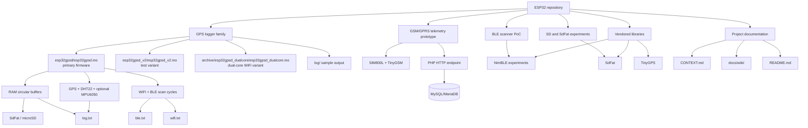

# Graphify do repositório

Este mapa conecta os sistemas, firmware, sensores, fluxos de dados e documentação do repositório. As páginas da [wiki](wiki/README.md) explicam cada área em mais detalhe.

## Relações principais

- `esp32gpsd` é a linha principal do logger local: sensores e posição alimentam `log.txt`; scanners WiFi/BLE alimentam `wifi.txt` e `ble.txt` através de buffers e cache de deduplicação.
- `esp32gpsd_v2` é uma variante de teste muito próxima da principal. Consulte o código e o README dessa pasta para diferenças atuais antes de tratá-la como release independente.
- `esp32gpsd_dualcore` distribui leitura de sensores/GPS e trabalho de WiFi/SD entre tarefas FreeRTOS; não possui BLE.
- `esp32_gsm_gps` é um protótipo separado: envia telemetria pela rede celular para uma API PHP que persiste em MySQL/MariaDB.
- `ble_scanner_poc` concentra experimentos antigos de BLE e sequenciamento por reinicialização; não representa o fluxo atual do logger principal.
- `libraries/`, `archive/esp32_gsm_gps/TinyGPS/`, `archive/esp32_gsm_gps/DHT_sensor_library/` e componentes dentro de `archive/archive_tests/` são dependências/fontes vendorizadas, não firmware principal.

## Navegação

- [Índice da wiki](wiki/README.md)
- [Arquitetura do logger](wiki/arquitetura-logger.md)
- [Variantes e protótipos](wiki/variantes.md)
- [Dados e hardware](wiki/dados-hardware.md)
- [Inventário do repositório](wiki/inventario.md)
- [Contexto e glossário](../CONTEXT.md)

## Artefatos gerados

`graphify-out/`, na raiz, é versionado. Consulte
[`GRAPH_REPORT.md`](../graphify-out/GRAPH_REPORT.md) antes de navegar pelo código.
Depois de alterar código ou mover arquivos, execute `graphify update .`.
Serena permanece ativo para análise por símbolos; sua configuração compartilhada
fica em `.serena/project.yml`, enquanto cache e logs permanecem locais.

O grafo tem cobertura parcial: sketches `.ino` não são classificados pelo
extrator atual, algumas bibliotecas C++ geram avisos de parsing e o parser SQL
opcional não está instalado. Para avaliar uso do firmware, cruze o mapa com
READMEs, includes, builds e consultas Serena. Ausência no grafo não prova desuso.
