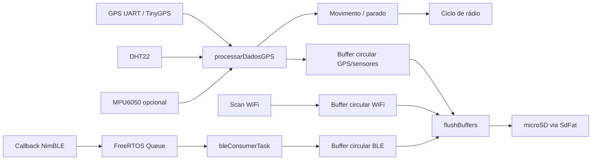

# Arquitetura do GPS Logger

## Fluxo de execução

Na linha principal, `setup()` inicializa periféricos, buffers e armazenamento; a configuração do BLE cria o scanner e a fila de consumo. O `loop()` alimenta o parser GPS e amostra sensores. Quando há atualização de posição, `processarDadosGPS()` atualiza o modo, compõe telemetria e direciona novas linhas aos buffers.

## Modos e rádio

O estado em RAM alterna entre movimento, sono parado e verificação parada. Em movimento, os ciclos WiFi/BLE se repetem segundo `RADIO_SCAN_INTERVAL_MS`; parado, há intervalo sem scan e depois um ciclo de verificação. Um retorno de velocidade acima do limiar leva de volta ao modo movimento. Constantes efetivas ficam no topo do sketch.

Na v1, o BLE usa callback no contexto da pilha, uma fila FreeRTOS de ponteiros e a tarefa `bleConsumerTask`. Na v2, `drenarFilaBLE()` consome essa fila na `loopTask`, sem tarefa separada. A fila desacopla o callback da formatação/armazenamento; se não houver espaço, o registro pode ser descartado para não bloquear a pilha. A deduplicação por ciclo e as caches de hashes reduzem repetições.

## Armazenamento

Os três buffers circulares acumulam linhas até o flush. Se um buffer encher, ele libera espaço descartando a entrada mais antiga. `flushBuffers()` grava os arquivos de forma agrupada. A v1 adquire `sdMutex`; na v2, buffers e objeto SdFat são usados pela `loopTask`, sem esse mutex. A implementação principal também adia gravações durante scans de rádio e tenta remontar o cartão após falhas.

| Arquivo | Conteúdo |
|---|---|
| `/log.txt` | Posição, data/hora, velocidade, direção, DHT22 e campos IMU; cabeçalho na inicialização quando o arquivo ainda não existe. |
| `/wifi.txt` | Redes WiFi observadas, intensidade, canal e segurança. |
| `/ble.txt` | MAC, nome se anunciado, RSSI e TX power BLE se anunciado. |

O log em RAM ainda não gravado pode se perder numa interrupção abrupta de energia. Consulte o código para limites e política atuais.

## Concorrência e limites

A v1 usa uma tarefa FreeRTOS para consumo BLE; a v2 concentra esse consumo na `loopTask`, que também realiza flush. A v2 retira o consumidor concorrente dos buffers e usa o filtro nativo de duplicatas do NimBLE, sem vetor compartilhado ou reinício em callback. A alternativa `esp32gpsd_dualcore` tem arquitetura diferente, com tarefas dedicadas a sensores e a WiFi/SD; ela não deve ser confundida com a linha principal. Veja [variantes](variantes.md).

## Hotspot na v3 (em teste)

A v3 mantém a aquisição e o consumo BLE da v2 na `loopTask`, e adiciona
`MODO_PARADO_HOTSPOT` depois do check WiFi/BLE e da tentativa de flush.
A tarefa `Hotspot_HTTP` atende página e downloads no core 1. O SD volta a usar
`sdMutex` para serializar leituras HTTP e escrita/remount; os buffers continuam
pertencendo à `loopTask`. Enquanto um download está aberto, flush/remount são
adiados. Inatividade HTTP de 5 min fecha o AP e inicia o sono; movimento
confirmado pela histerese fecha o AP e interrompe downloads. Temporizadores
e fechamento dos scans são atendidos por `servicoModo()` sem depender de fix
GPS novo. Consulte o [README da v3](../../esp32gpsd_v3/README.md).

## Construção e diagnóstico

O README do logger registra dependências Arduino e configuração de partição necessárias para combinar WiFi e NimBLE. Ajustes de SPI, watchdog, cache e buffers estão documentados no sketch e em [`esp32gpsd/README.md`](../../esp32gpsd/README.md). Para sinais de execução, consulte o dashboard serial e os registros gravados no cartão.
