# Arquitetura do GPS Logger

Esta página descreve a **v3** (`serial-2026-10-06-painel2`, snapshot 06/10/2026). Fonte: [firmware](../../esp32gpsd_v3/esp32gpsd_v3.ino) e [README v3](../../esp32gpsd_v3/README.md). Diferenças de outras versões estão em [Variantes](variantes.md).

[Atlas DrawIO editável](../../esp32gpsd_v3/docs/diagramas/esp32gpsd-v3.drawio) · [Índice dos 15 diagramas](../../esp32gpsd_v3/docs/diagramas/README.md)

## Fluxo integrado

Aquisição GPS/DHT/IMU e scans WiFi/BLE alimentam três buffers circulares. `loopTask` controla modos, drena fila BLE e grava no SD. `Hotspot_HTTP` lê arquivos pelo AP local enquanto parado; `sdMutex` serializa o armazenamento.

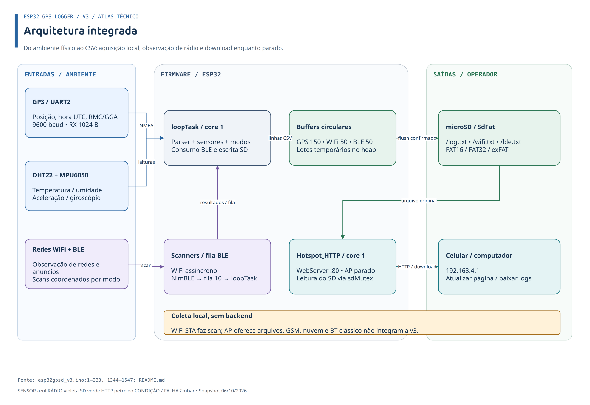

## Inicialização e ciclo principal

`setup()` prepara UART/buffers/sensores, espera montar SD, configura watchdog, registra boot e cria fila BLE/HTTP. MPU ausente e falha da tarefa HTTP permitem operação reduzida; falha de buffers/fila impede loop. SD inicial tenta montagem indefinidamente.

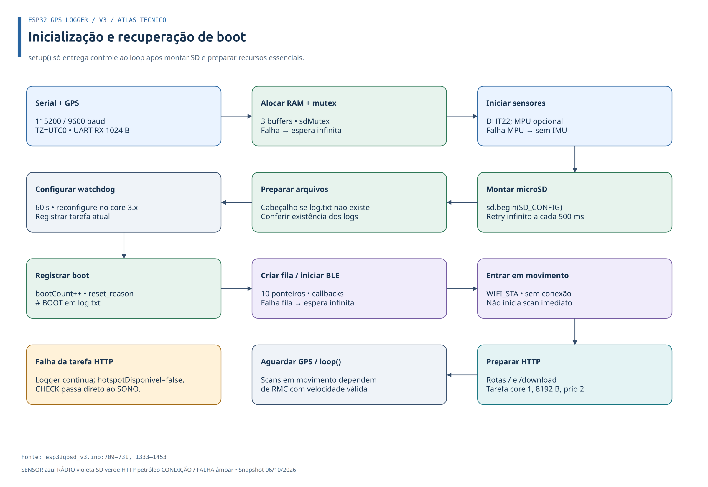

Aquisição normal dura ≈1 s. MPU é amostrado a cada 100 ms; DHT, no mínimo a cada 2 s. Em seguida vêm composição, `servicoModo()`, eventos HTTP, retry SD e resumo. Foco HTTP tem retorno antecipado e não executa essas etapas.

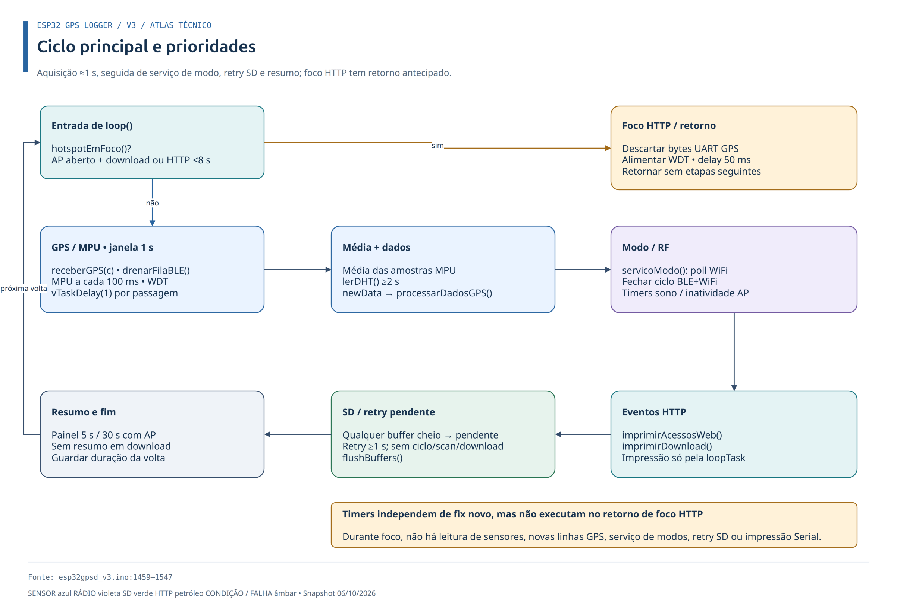

## Modos e histerese

RMC com velocidade válida chama `atualizarModo()` dentro de `receberGPS()`. Movimento → CHECK ocorre com ≤2 km/h; qualquer estado parado → movimento exige >5 km/h em 5 RMCs válidos consecutivos. Leitura ≤5 zera contador. Sem velocidade nova, modo é mantido.

CHECK fecha ciclo final e tenta flush antes do AP. AP sem atividade HTTP por 5 min, sem download, vai ao SONO. Sono lógico dura 5 min, sem deep sleep; depois inicia CHECK. `servicoModo()` atende temporizadores sem depender de fix novo, exceto quando o loop está em foco HTTP.

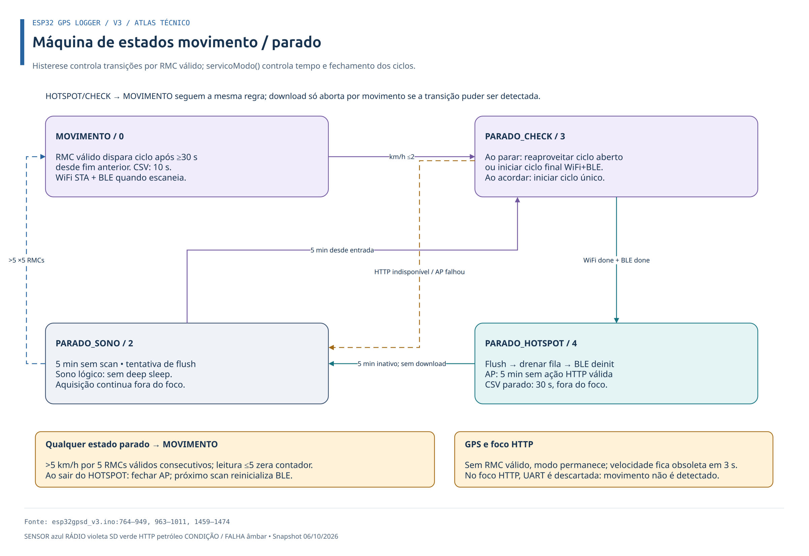

## Rádio e consumo BLE

BLE inicia em `iniciarCicloRadio()`; WiFi é disparado/pollado por `servicoModo()`. Ciclo termina quando ambos concluíram ou reportaram falha. Em movimento, novo ciclo exige RMC válido e ≥30 s desde fim anterior; parado, ocorre no CHECK. BLE ativo dura 5 s; duração WiFi depende de resultado real.

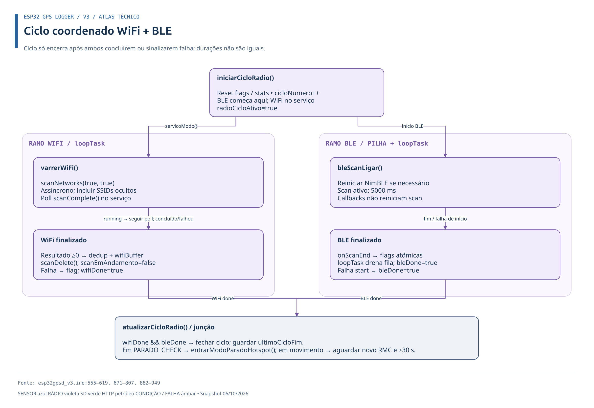

Callback BLE aloca registro e tenta enviar ponteiro para fila de 10 entradas, sem bloquear. Fila cheia/alocação falha incrementam perdas. `drenarFilaBLE()` na `loopTask` compõe CSV com última posição/hora e libera registro. Dedup usa FNV-1a 32 bits, 500 hashes de SSID e 500 de MAC; hash é inserido antes da confirmação no SD.

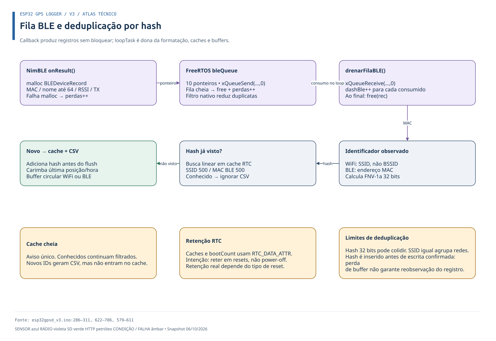

## Armazenamento e recuperação

Buffers: GPS 150×160 bytes; WiFi/BLE 50×256 bytes cada. Cheio descarta linha mais antiga. Flush é solicitado por capacidade e entradas HOTSPOT/SONO; adiado durante scan ou download. Escrita exige tamanho completo, `sync()` e `close()`; confirmação é por arquivo, sem transação dos três logs. Falha retém lote incerto, tenta remount e mantém retry pendente; retry pode duplicar linhas. Dez remounts falhos seguidos reiniciam ESP32.

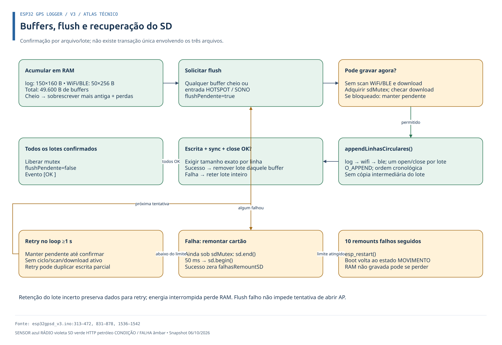

## Concorrência e ownership

`loopTask` e `Hotspot_HTTP` rodam no core 1. HTTP: prioridade 2, stack 8192 bytes. Afinidade interna das pilhas depende do core/IDF. Buffers/caches pertencem à `loopTask`; HTTP não os modifica. `sdMutex` protege operações SdFat; `downloadAtivo` sob mutex impede flush/remount com arquivo aberto. Snapshots da página são `volatile`; estado/métricas HTTP são atômicos.

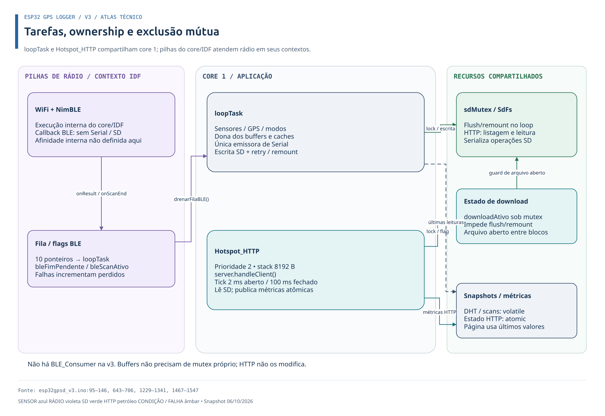

## Hotspot e prioridade HTTP

Antes do AP, tentativa de flush → drenar fila → desinicializar NimBLE para liberar heap. Próximo scan reinicializa BLE. Página `http://192.168.4.1/` mostra últimos scans/DHT e arquivos; HTML/CSS sem JS/API, enviada em chunks e atualizada manualmente. Cada arquivo tem Baixar e Apagar (`POST /apagar`, recria cabeçalho do `log.txt`). Abrir/atualizar/baixar/apagar renova atividade; só conectar ao AP não renova.

**Limitação atual:** download ou HTTP nos últimos 8 s ativa foco: UART GPS descartada, sensores/SD/modos/painel pausados, apenas watchdog e delay. Movimento não é detectado enquanto foco estiver ativo. A descrição de fechamento por velocidade exige que processamento GPS tenha retomado.

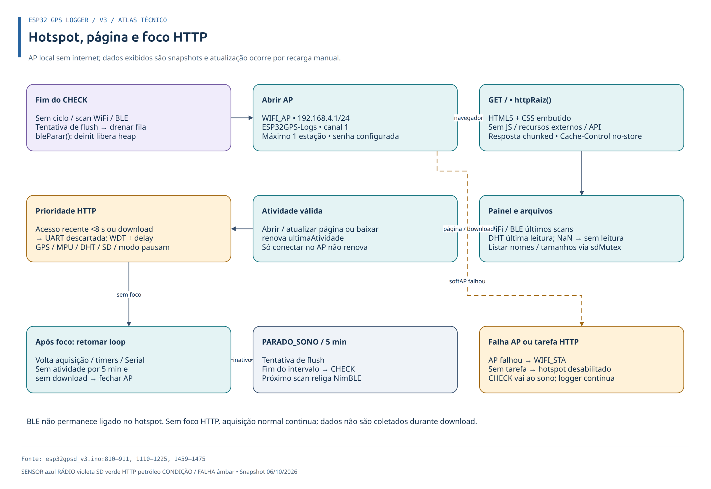

## Download dos logs

Allowlist: `log.txt`, `wifi.txt`, `ble.txt`. SD é lido em blocos de até 2048 bytes sob mutex, liberado no envio TCP. Falha SD, desconexão, AP fechado ou 15 s sem progresso abortam. Acima de 4.294.967.295 bytes é recusado. Sucesso exige todos os bytes e `close()` confirmado. HTTP publica resultado; loop imprime e libera estado para próxima transferência.

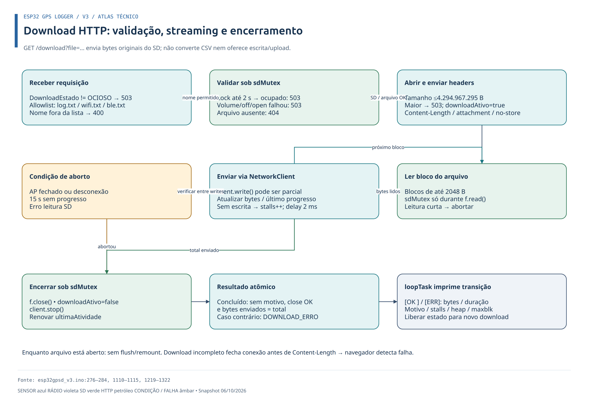

## Construção e diagnóstico

[Compilação](compilacao-arduino-cli.md) detalha bibliotecas sincronizadas e partição `no_ota`. Console: 115200 baud, resumo 5 s/30 s com AP, mudo em download; eventos somente na `loopTask`. Testes host usam TinyGPS real e SD simulado; não substituem validação em placa.

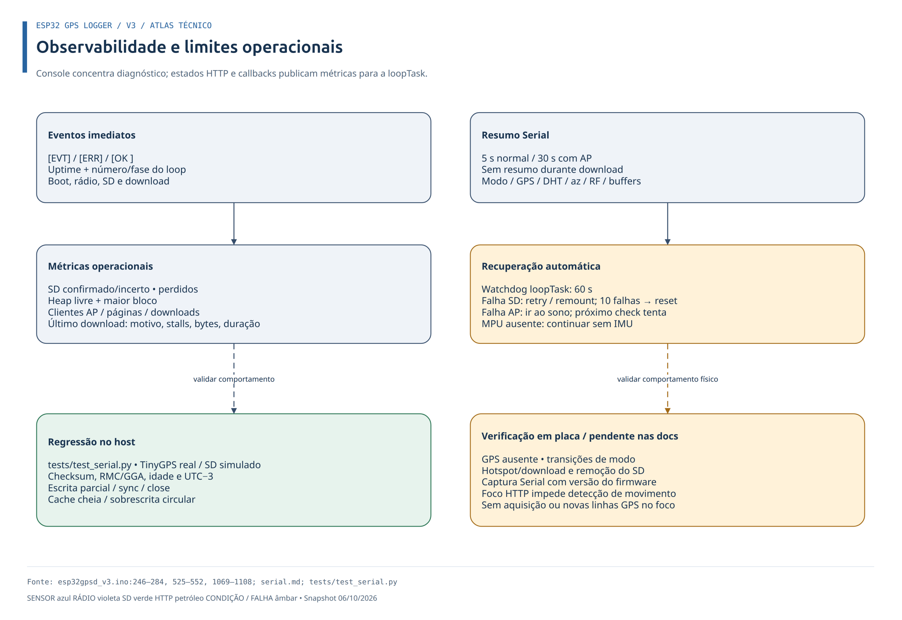

## Outras versões

V1 usa `bleConsumerTask`; v2 concentra consumo BLE/SD na `loopTask` sem mutex SD; v3 adiciona HTTP e restaura `sdMutex`. Variante dual-core sem BLE tem tarefas distintas. Estes gráficos representam somente v3; consulte [histórico e variantes](variantes.md).
