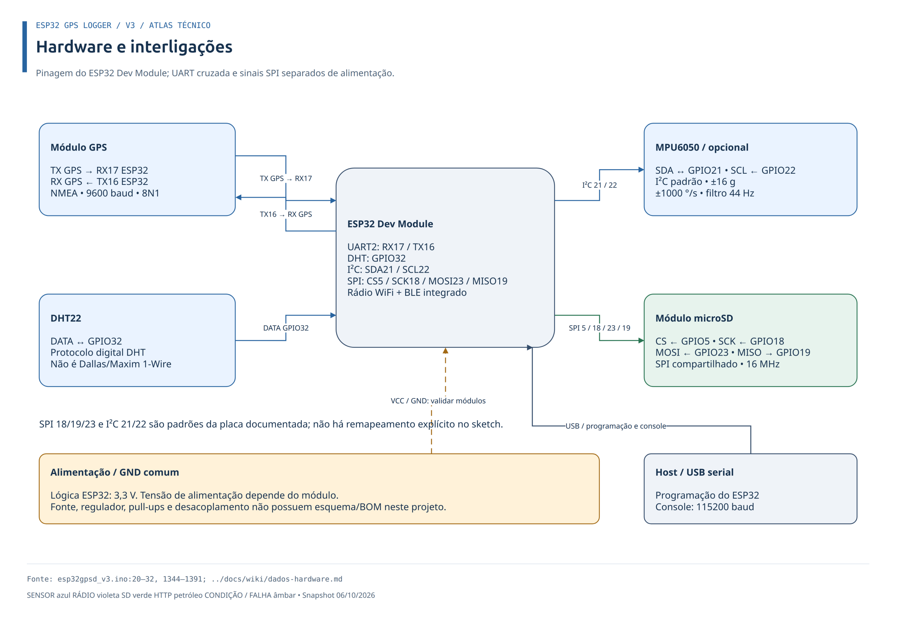
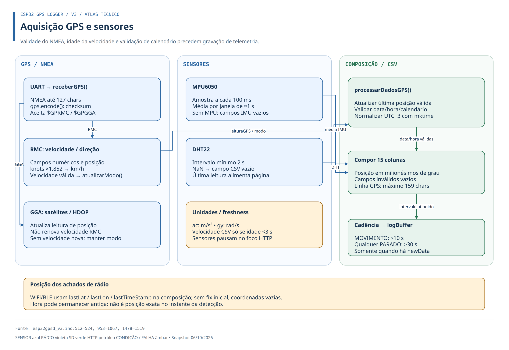
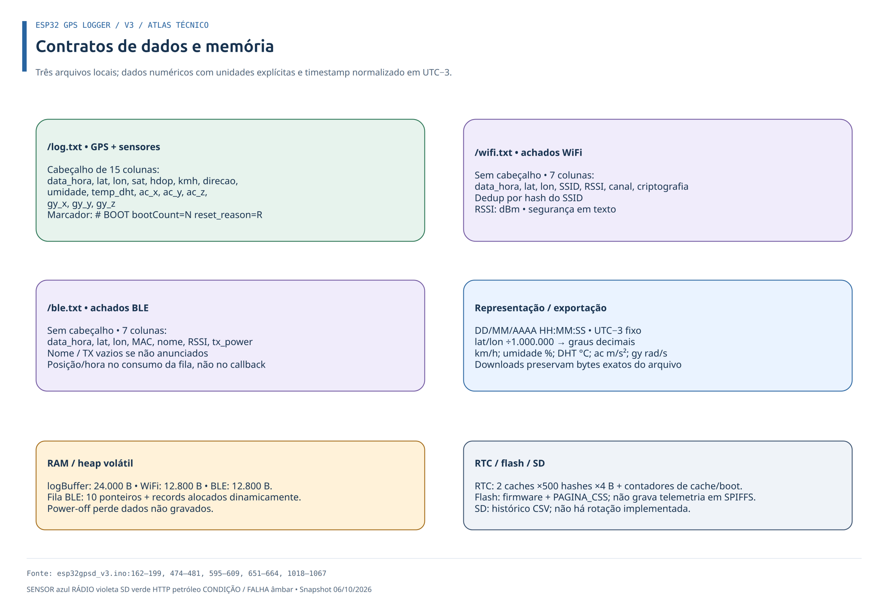

# Hardware, configuração e dados

## Ligações do logger v3

[Atlas DrawIO editável](../../esp32gpsd_v3/docs/diagramas/esp32gpsd-v3.drawio) · [Índice dos 15 diagramas](../../esp32gpsd_v3/docs/diagramas/README.md)

| Módulo | Interface | GPIO no firmware v3 |
|---|---|---|
| GPS NEO-6M | UART2 | RX do ESP32 = 17; TX do ESP32 = 16 |
| DHT22 | Digital | 32 |
| MPU6050 (opcional) | I²C | SDA 21; SCL 22 |
| Cartão SD | SPI | CS 5; MOSI 23; MISO 19; SCK 18 |

Confirme a pinagem no sketch antes de ligar uma placa diferente. Alimentação depende do módulo específico; não presuma que qualquer periférico aceita 5 V.

O desenho representa interligações documentadas para ESP32 Dev Module, não um esquema elétrico completo. Não há BOM, regulador ou valores de pull-up/desacoplamento documentados. UART GPS usa 9600 baud, DHT GPIO32, SPI 16 MHz e I²C padrão 21/22.

## Configurações relevantes

O sketch define baud rate GPS, pinos, clock SPI, tamanhos dos buffers, limites de cache, timeout do watchdog e limiares/intervalos de movimento e scan. Essas definições são a referência para os valores atuais. O README do logger explica a seleção de partição e as bibliotecas utilizadas.

## Aquisição na v3

GPS RMC/GGA é validado com TinyGPS. RMC renova velocidade; GGA não. MPU é amostrado a cada 100 ms e agregado na janela de ≈1 s; DHT respeita mínimo 2 s. Foco HTTP pausa aquisição.

## Dados registrados

`log.txt` agrega data/hora, latitude/longitude, satélites, HDOP, velocidade, direção, umidade/temperatura e medidas IMU. Se o MPU6050 não inicializar, os campos IMU podem ficar sem valor.

`wifi.txt` registra data/hora, posição associada, SSID, RSSI, canal e tipo de segurança. `ble.txt` registra data/hora, posição associada, endereço MAC, nome, RSSI e TX power quando disponível. A coordenada e a hora refletem a última posição GPS conhecida no momento em que o registro é composto.

Arquivos de exemplo da pasta [`log/`](../../log) são amostras, não contratos de formato; confirme cabeçalhos/ordem no firmware correspondente.

Na v3, coordenadas são milionésimos de grau e timestamp é UTC−3 fixo. `log.txt` tem cabeçalho e marcadores `# BOOT`; arquivos de rádio não têm cabeçalho. Dados em RAM se perdem no power-off; RTC busca retenção dependente do tipo de reset. Downloads preservam os bytes originais.

## Logger celular

O sketch combinado da pasta [`archive/esp32_gsm_gps/`](../../archive/esp32_gsm_gps) usa SIM800L em UART, TinyGSM e um endpoint HTTP; o conjunto inclui `get.php`, `db_connect.php` e `database_setup.sql`. Os pinos e APN variam entre exemplos. Há valores de configuração sensíveis/documentados em arquivos antigos: não publique credenciais reais nem reutilize valores do README sem validar e substituir no ambiente de implantação.
