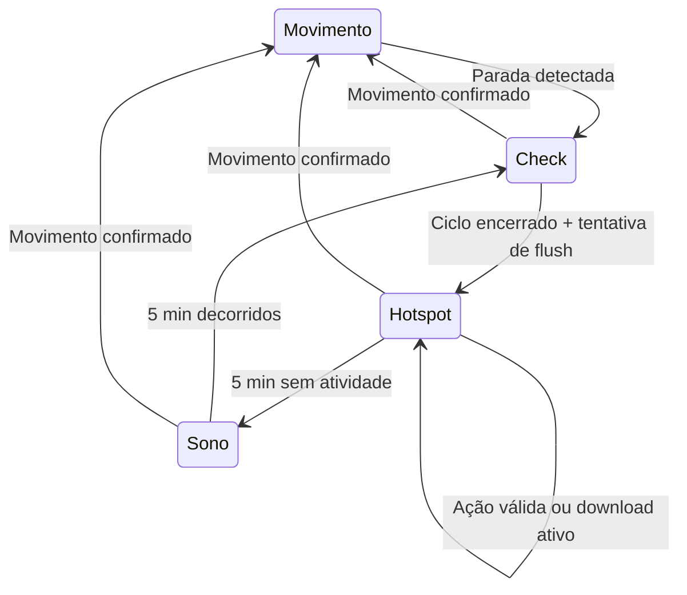

# Hotspot temporário para download dos logs do SD

Plano de implementação para `esp32gpsd_v2/esp32gpsd_v2.ino`.

## 1. Objetivo, bibliotecas e comportamento

Adicionar acesso local por WiFi aos arquivos existentes no cartão SD. Quando veículo estiver parado, ESP32 disponibilizará hotspot temporário. Celular ou computador conecta à rede, abre navegador e baixa logs individualmente.

**Preservar biblioteca SD já validada no projeto:** SdFat instalada, versão **2.3.0**, com objeto global `SdFs sd`, arquivos `FsFile`, montagem e configuração SPI atuais. Manter suporte FAT16/FAT32/exFAT conforme configuração existente.

Adicionar servidor HTTP com **`WebServer.h`**, incluído no Arduino ESP32 **3.3.12** instalado. Hotspot será criado pela biblioteca **`WiFi.h`**, já usada no sketch. [WebServer oficial](https://github.com/espressif/arduino-esp32/tree/3.3.12/libraries/WebServer), [API SoftAP](https://docs.espressif.com/projects/arduino-esp32/en/latest/api/wifi.html).

`ESPAsyncWebServer` foi pesquisada e suporta Arduino 3.x, mas requer AsyncTCP. Escolha deste plano permanece WebServer: um dispositivo, downloads sequenciais e tarefa própria são suficientes. [Projeto mantido](https://github.com/ESP32Async/ESPAsyncWebServer).

### Experiência de uso

1. Veículo entra no modo parado pelos critérios atuais.
2. ESP32 conclui ciclo WiFi/BLE existente e tenta descarregar buffers no SD.
3. Rede `ESP32GPS-Logs` aparece.
4. Usuário conecta com senha configurada no sketch.
5. Abre **`http://192.168.4.1/`**.
6. Página mostra logs disponíveis, tamanhos e botões de download.
7. Abrir página, atualizar lista ou iniciar download válido renova janela.
8. Sem atividade durante cinco minutos, hotspot encerra.
9. ESP32 permanece cinco minutos sem scans.
10. Executa novo ciclo WiFi/BLE, tenta flush e reabre hotspot.

A conexão à rede, sozinha, não prolonga janela. Não há dependência de internet, aplicativo instalado ou servidor externo.

### Arquivos disponibilizados

| Arquivo | Conteúdo |
|---|---|
| `log.txt` | GPS, movimento e sensores, conforme CSV atual |
| `wifi.txt` | Redes WiFi registradas |
| `ble.txt` | Dispositivos BLE registrados |

Downloads preservam bytes e nomes originais. Não acrescentar cabeçalho, converter CSV, compactar ou modificar conteúdo.

---

## 2. Máquina de estados e integração com os scans

### Estados de aplicação

Preservar estados existentes e acrescentar `MODO_PARADO_HOTSPOT`.

| Estado | Comportamento |
|---|---|
| `MODO_MOVIMENTO` | Sensores e ciclos de scan conforme cadência atual |
| `MODO_PARADO_CHECK` | Um ciclo WiFi/BLE, antes de abrir hotspot |
| `MODO_PARADO_HOTSPOT` | Hotspot disponível; scans suspensos; aquisição continua |
| `MODO_PARADO_SONO` | Hotspot desligado; cinco minutos sem scans; aquisição continua |

Início e encerramento do HTTP terão fases internas de preparação/parada, sem exigir novos modos públicos.



### Critérios de movimento

Preservar valores atuais:

- Movimento → parado: velocidade ≤ **2 km/h**.
- Parado → movimento: velocidade > **5 km/h** por **cinco fixes consecutivos**.
- Cadência de log: **10 segundos** em movimento, **30 segundos** parado.
- Intervalo de scans em movimento: **30 segundos**, conforme lógica atual.
- Duração BLE: **5 segundos**, conforme configuração atual.

“Desligar ao movimentar” significa após confirmação pela histerese existente, não após um único pico de velocidade.

### Entrada no hotspot

1. Concluir ciclo de scans já aberto.
2. Impedir início de outro ciclo.
3. Confirmar encerramento dos scans WiFi e BLE.
4. Tentar `flushBuffers()`.
5. Configurar IP e modo SoftAP.
6. Iniciar hotspot.
7. Solicitar início do servidor à tarefa HTTP.
8. Ao servidor confirmar disponibilidade, iniciar janela de cinco minutos.

Flush malsucedido não impede página de abrir. Buffers permanecem retidos conforme comportamento atual; interface mostra indisponibilidade quando cartão não puder ser acessado.

### Sono e reabertura

Encerramento por inatividade:

1. Solicitar parada HTTP.
2. Tarefa fecha cliente e arquivo eventualmente aberto.
3. Confirmar tarefa HTTP inativa.
4. Desligar SoftAP.
5. Restaurar WiFi em modo STA, sem iniciar scan.
6. Entrar em `MODO_PARADO_SONO`.
7. Iniciar contador de cinco minutos após encerramento efetivo.
8. Ao vencer contador, iniciar check WiFi/BLE.
9. Ao finalizar check, repetir preparação do hotspot.

O período de sono continua sendo pausa de scans. Não introduzir deep sleep nem reinicialização.

### Retorno ao movimento

Movimento confirmado tem prioridade sobre extensão por download:

- Solicitar cancelamento HTTP.
- Impedir novos downloads.
- Encerrar transferência e fechar arquivo.
- Aguardar confirmação da tarefa.
- Desligar hotspot e restaurar `WIFI_STA`.
- Atender flush pendente quando permitido.
- Retomar scans pela lógica de movimento existente.

Aquisição de sensores continua durante encerramento. Loop não deve aguardar confirmação em uma espera bloqueante.

### Correção necessária no encerramento WiFi

Na implementação instalada, **`WiFi.scanDelete()` libera resultados e limpa estado interno; não cancela scan físico por si só**.

Normalmente, hotspot abre após término natural do ciclo. Se precisar interromper scan, usar `esp_wifi_scan_stop()`, tratar resultado e só depois limpar resultados/flags. Não marcar rádio como parado apenas por chamar `scanDelete()`.

Confirmar parada BLE usando resultado de `stop()` e estado do scanner. `bleParar` deve impedir reinício automático antes da solicitação de parada.

### Temporizadores sem novos fixes

Controle temporal precisa executar em cada volta do loop, fora da condição `if (newData)`:

- Inatividade do hotspot.
- Expiração do sono.
- Início/parada HTTP.
- Conclusão do ciclo de scans.
- Flush pendente.

Centralizar início/poll dos scans para executar uma única vez por ciclo do loop. Dashboard utiliza estatísticas já obtidas.

Se GPS parar de entregar dados depois de entrar no modo parado, hotspot e sono continuam ciclando. Usar última posição disponível para rotular achados; não inventar novos fixes.

No boot sem informação suficiente para determinar parada, preservar estado inicial atual de movimento.

---

## 3. Tarefas, configuração e interface HTTP

### Distribuição entre cores

| Contexto | Responsabilidade |
|---|---|
| Core 0, configuração atual | Driver WiFi, controlador Bluetooth e host NimBLE |
| Core 1, `loopTask` | GPS/sensores, estados, decisão sobre WiFi, scans e flush |
| Core 1, `BLE_Consumer` | Deduplicação persistente e buffer BLE |
| Core 1, nova tarefa HTTP | Requisições, listagem e transmissão dos arquivos |

Nova tarefa: nome **`Hotspot_HTTP`**, prioridade **1**, stack inicial **8192 bytes**.

Criar uma vez no boot. Fora das janelas de hotspot, bloquear esperando comando. Durante atendimento, ceder CPU com espera curta.

Servidor HTTP não deve executar no `loop()`. Download de arquivo grande não pode manter aquisição parada por toda transferência.

### Configuração inicial

| Configuração | Valor inicial |
|---|---|
| SSID | `ESP32GPS-Logs` |
| Senha | `gpsdlogs2026` |
| Canal | 1 |
| IP/gateway | `192.168.4.1` |
| Máscara | `255.255.255.0` |
| Porta HTTP | 80 |
| Dispositivos conectados | 1 |
| Janela de inatividade | 300000 ms |
| Sono entre janelas | `PARKED_SLEEP_MS`, atualmente 300000 ms |
| Timeout sem progresso | 15000 ms |
| Bloco de leitura | 2048 bytes |
| Stack HTTP | 8192 bytes |
| Prioridade HTTP | 1 |
| Core HTTP | 1 |

SSID e senha definidos em constantes próximas às demais configurações. Documentar senha inicial como valor editável antes de gravar firmware.

Validar senha com comprimento compatível com SoftAP protegido. Configuração inválida gera mensagem Serial e segue ciclo de sono/retry.

### Comunicação entre loop e tarefa HTTP

Usar fila FreeRTOS de **um elemento**, como caixa de comando:

- Comandos: `INICIAR` e `PARAR`.
- Publicação por `xQueueOverwrite()`: decisão mais recente substitui comando pendente.
- Tarefa bloqueia em `xQueueReceive(..., portMAX_DELAY)` quando inativa.
- Durante transferência, verificar comando de parada entre operações.

Estado publicado pela tarefa:

- `PARADO`.
- `INICIANDO`.
- `PRONTO`.
- `PARANDO`.
- `FALHA`.

Publicar estado por `std::atomic` ou estrutura protegida. Não usar apenas `volatile` como mecanismo de sincronização.

Também sincronizar:

- Instante da última atividade.
- Indicador de download ativo.
- Indicador de arquivo SD aberto para transferência.
- Solicitação de flush após transferência.

Loop é proprietário da máquina de estados e das chamadas que alteram modo WiFi. Tarefa HTTP é proprietária de `WebServer`, cliente atendido e `FsFile` do download.

### Inicialização

Depois de criar buffers e montar SD:

1. Criar mutex necessário ao buffer BLE.
2. Criar fila de comandos.
3. Alocar buffer de transmissão de 2048 bytes uma única vez.
4. Criar tarefa HTTP.
5. Conferir retornos de alocação e criação.

Falha no módulo HTTP deve ser reportada sem impedir funcionamento principal do logger. Se recursos não estiverem disponíveis, janelas de hotspot ficam desabilitadas naquele boot.

Falha transitória ao iniciar SoftAP segue sono/check e permite nova tentativa no próximo ciclo.

### Página `GET /`

Página leve, gerada pelo firmware:

- Título indicando download dos logs.
- Arquivos existentes.
- Tamanho em bytes e apresentação legível.
- Botão **Baixar** por arquivo.
- Botão **Atualizar lista**, que recarrega a página.
- Informação de encerramento após cinco minutos sem atividade.
- Mensagem quando nenhum arquivo existir.
- Mensagem quando SD estiver indisponível.

HTML/CSS locais, sem CDN, fontes externas ou chamadas à internet. Tamanho de arquivos formatado a partir de inteiro de 64 bits.

Resposta com `Cache-Control: no-store`, para atualização refletir estado do cartão.

Abrir ou atualizar página renova janela. Requisições auxiliares, como `/favicon.ico`, não renovam.

### Download `GET /download?file=...`

Aceitar exatamente:

- `log.txt`.
- `wifi.txt`.
- `ble.txt`.

Associar nomes recebidos aos caminhos constantes já existentes no sketch. Não concatenar entrada arbitrária ao caminho SD.

Comportamento:

| Situação | Resposta |
|---|---|
| Nome permitido e arquivo disponível | `200`, download |
| Parâmetro ausente/inválido | `400` |
| Arquivo ausente em volume operacional | `404` |
| SD inacessível ou falha de abertura | `503` |
| Rota inexistente | `404` |
| Método diferente de GET nas rotas conhecidas | `405` |

Download válido renova atividade. Solicitações inválidas não prolongam hotspot.

Sem exclusão, alteração, upload, navegação arbitrária do cartão ou download em ZIP.

---

## 4. SdFat, arquivos grandes e sincronização

### Compatibilidade obrigatória

Continuar usando:

- `SdFs sd`.
- `FsFile`.
- `SD_CONFIG`.
- CS atual: **GPIO 5**.
- Clock SPI atual: **16 MHz**.
- Modo `SHARED_SPI`.
- Montagem e recuperação existentes.

Preservar versão SdFat e configuração validada para cartões grandes.

`WebServer::streamFile()` não será usado diretamente: chama `file.name()`, que a SdFat instalada rejeita em favor de `getName()`.

### Acesso ao cartão

Todas as operações HTTP com SdFat precisam adquirir `sdMutex`:

- Consultar arquivos.
- Abrir.
- Obter tamanho.
- Ler bloco.
- Fechar.

Liberar mutex antes de esperar rede ou enviar dados.

Objeto `FsFile` pertence exclusivamente à tarefa HTTP. `sdMutex` protege volume/barramento; outras tarefas não manipulam esse objeto de arquivo.

### Escritas durante download

Para manter conteúdo consistente e evitar remount com arquivo aberto:

1. Adquirir `sdMutex`.
2. Validar arquivo e abrir somente para leitura.
3. Capturar tamanho inicial.
4. Publicar indicador de transferência SD ativa.
5. Liberar mutex.
6. Enquanto arquivo estiver aberto, `flushBuffers()` adia escritas.
7. `remontarSD()` também fica adiado.
8. Aquisição continua adicionando dados aos buffers.
9. Ao concluir/abortar, fechar arquivo sob mutex.
10. Limpar indicador e solicitar flush pela tarefa principal.

Flush verifica indicador antes de esperar mutex e novamente depois de adquiri-lo. Segunda verificação evita corrida entre decisão de escrever e abertura do arquivo HTTP.

Após transferência, loop tenta descarregar buffers quando nenhum scan estiver ativo. Se falhar, manter solicitação pendente e seguir recuperação existente.

### Política dos buffers

Preservar capacidades atuais:

| Buffer | Capacidade |
|---|---|
| GPS/sensores | 150 linhas |
| WiFi | 100 linhas |
| BLE | 100 linhas |

Preservar política circular: ao encher, linhas mais antigas podem ser descartadas.

Parado, buffer GPS suporta aproximadamente **75 minutos** de novas linhas quando inicialmente vazio, pela cadência de 30 segundos. Download excepcionalmente longo pode consumir essa margem; plano não promete retenção ilimitada.

### Corrida no buffer BLE

Criar `bleBufferMutex`, usado por:

- Consumidor ao inserir linha e alterar índices/contador.
- Flush ao escrever/remover linhas BLE.

Ordem de locks quando ambos forem necessários:

**`sdMutex` → `bleBufferMutex`.**

Consumidor adquire apenas `bleBufferMutex`. Não adquirir `sdMutex` mantendo o mutex BLE.

Nenhum desses locks permanece adquirido durante transmissão pela rede.

### Vetor da deduplicação transiente

Proteger `seenInCycleBLE` entre callbacks e operações de início de ciclo.

Usar mutex próprio, com trechos curtos. Nunca chamar `pBLEScan->start()` ou `stop()` mantendo esse mutex: callbacks podem participar dessas operações.

Essa proteção não deve abranger acesso SD, envio HTTP ou formatação de página.

### Transferência acima de 4 GB

Usar **`uint64_t`** para:

- Tamanho capturado por `FsFile::fileSize()`.
- Quantidade restante.
- Total transmitido.
- Contadores apresentados no Serial/página.

Usar `size_t` apenas para tamanho do bloco atual, limitado a 2048 bytes.

Não passar tamanho total a `WebServer::setContentLength()`: no ESP32, `size_t` tem 32 bits.

Enviar cabeçalhos HTTP manualmente pelo cliente atendido, com tamanho decimal de 64 bits:

```http
HTTP/1.1 200 OK
Content-Type: text/plain; charset=utf-8
Content-Disposition: attachment; filename="log.txt"
Content-Length: <tamanho decimal em 64 bits>
Cache-Control: no-store
Connection: close

```

Formatar tamanho com macro apropriada de `<inttypes.h>`, como `PRIu64`.

Cabeçalhos e conteúdo passam pela mesma rotina de envio cancelável. Não usar `server.send()` para essa resposta de download, evitando dois conjuntos de cabeçalhos.

### Algoritmo do download

1. Validar parâmetro pela lista permitida.
2. Abrir arquivo sob mutex.
3. Capturar tamanho de 64 bits.
4. Marcar download ativo.
5. Enviar cabeçalhos.
6. Ler até 2048 bytes sob mutex.
7. Liberar mutex.
8. Enviar bloco completo, tratando escritas parciais.
9. Atualizar total/progresso apenas pelos bytes aceitos.
10. Verificar cancelamento, conexão e timeout.
11. Repetir até transmitir tamanho capturado.
12. Fechar arquivo sob mutex.
13. Encerrar cliente.
14. Limpar flags.
15. Publicar solicitação de flush.
16. Reiniciar janela de cinco minutos, se ainda parado.

Arquivo vazio recebe `200` com `Content-Length: 0`, sem leitura de conteúdo.

Leitura menor que solicitada antes do tamanho esperado, ou erro SdFat, encerra conexão como transferência incompleta. Não acrescentar mensagem de erro ao CSV após envio dos cabeçalhos.

### Envio cancelável

Na biblioteca instalada, `NetworkClient.write()` pode realizar tentativas internas de aproximadamente um segundo, repetidas. Para garantir verificação frequente de parada/progresso, implementar helper de envio usando socket do cliente:

- Obter descriptor por `client.fd()`.
- Enviar com `send(..., MSG_DONTWAIT)`.
- Tratar retorno positivo como progresso.
- Em `EAGAIN`/`EWOULDBLOCK`, aguardar disponibilidade com `select()` por até **100 ms**.
- Em `EINTR`, repetir após verificar cancelamento.
- Em erro definitivo, abortar.
- Conferir comando de parada e timeout em cada iteração.
- Ceder CPU entre blocos.

Usar APIs de sockets fornecidas pelo próprio ESP32, sem biblioteca de rede adicional.

Timeout de 15 segundos mede ausência de bytes aceitos pelo socket. Não limitar duração total de download que continua progredindo.

### Cleanup obrigatório

Executar mesma rotina de encerramento em:

- Conclusão.
- Desconexão.
- Timeout.
- Movimento.
- Erro SD.
- Erro de rede.
- Solicitação de parada HTTP.

Cleanup fecha arquivo sob mutex, limpa estado de transferência, fecha cliente e solicita flush quando houver dados pendentes.

Não deletar tarefa HTTP à força. Ela permanece disponível para próximos ciclos.

### Watchdog

Preservar watchdog do loop. Tarefa HTTP não deve chamar `esp_task_wdt_reset()` para tentar alimentar watchdog de outra tarefa.

Paradas e espera por HTTP precisam ser assíncronas para aplicação continuar alimentando seu watchdog.

---

## 5. Alterações, observabilidade e validação

### Pontos de alteração

Concentrar implementação em `esp32gpsd_v2.ino`, organizada em blocos:

- Configurações do hotspot.
- Estado/comandos HTTP.
- Helpers de acesso e transferência.
- Rotas e tarefa HTTP.
- Integração com estados parado/movimento.
- Proteção dos buffers/deduplicação afetados.

Adaptar:

- `setup()`: inicialização dos recursos HTTP.
- `loop()`: serviço temporal independente de novos fixes.
- `atualizarModo()`: tratamento do estado hotspot.
- `atualizarCicloRadio()`: conclusão levando ao hotspot.
- Entradas dos modos: sequência segura HTTP/WiFi/SD.
- `flushBuffers()`: adiamento durante download.
- `remontarSD()`: proteção contra arquivo aberto.
- Consumidor BLE e manipulação de seu buffer/vetor.

Atualizar README da variante com SSID/senha, IP, ciclos, arquivos disponíveis e configuração.

### Mensagens Serial

Registrar eventos relevantes:

- Entrada na janela de hotspot.
- SSID/IP e duração configurada.
- Falha de inicialização.
- Início do download: nome e tamanho.
- Conclusão: bytes transmitidos e duração.
- Aborto: movimento, desconexão, timeout, rede ou SD.
- Encerramento por inatividade.
- Entrada no sono.
- Novo check e reabertura.
- Flush adiado por transferência e posterior retomada.

Não imprimir cada bloco transmitido. Isso adicionaria carga Serial desnecessária.

### Validação de compilação

Compilar com:

- Arduino ESP32 **3.3.12**.
- SdFat **2.3.0** instalada.
- NimBLE e demais dependências atuais.
- Mesmo perfil de placa.
- Partition Scheme atual, **No OTA (Large APP)**.

Conferir ausência de conversões do tamanho total para 32 bits, retorno da criação da tarefa e tratamento de falhas de alocação.

### Cenários na placa

| Cenário | Resultado esperado |
|---|---|
| Parar durante ciclo de scan | Concluir ciclo antes de abrir hotspot |
| Ninguém conecta | Encerrar após 5 min; dormir 5 min; scan e reabrir |
| Conectar sem abrir página | Conexão não renova prazo |
| Abrir página próximo do vencimento | Nova janela de 5 min |
| Atualizar lista | Tamanhos atualizados; prazo renovado |
| Download ultrapassa 5 min | Continua enquanto houver progresso |
| Download termina | Nova janela de 5 min; flush pendente atendido |
| Cliente desconecta | Arquivo fechado; flags limpas |
| Rede deixa de progredir | Aborto após 15 s sem progresso |
| Movimento durante transferência | Cancelar, fechar e retornar ao modo movimento |
| GPS deixa de produzir novos dados | Ciclo hotspot/sono/check continua |
| Arquivo inexistente | `404`, sem criação de arquivo |
| Nome arbitrário/traversal | `400`, sem acesso ao caminho solicitado |
| Arquivo vazio | Download válido de zero bytes |
| SD inacessível | Erro compreensível; buffers preservados |
| Segundo dispositivo tenta conectar | Limite de uma estação respeitado |
| Ciclos repetidos | Heap/stack permanecem estáveis; tarefa reutilizada |

### Integridade e cartões grandes

- Usar cartão grande já validado no projeto.
- Comparar tamanho e hash do arquivo baixado com original retirado do SD.
- Repetir para os três logs.
- Testar FAT32 e exFAT disponíveis.
- Testar arquivo acima de **4 GB em exFAT**, quando disponível.
- Diferenciar capacidade grande do cartão e arquivo grande: cartão grande pode conter arquivos pequenos; ambos os aspectos exigem avaliação.
- Confirmar encerramento incompleto detectável quando transferência for interrompida.
- Confirmar flush/remount não ocorre com arquivo de download aberto.

### Aquisição e recursos

Durante download prolongado:

- Confirmar drenagem UART GPS.
- Observar continuidade da amostragem MPU.
- Confirmar produção de linhas na cadência parado.
- Verificar ausência de scan durante hotspot.
- Observar heap livre e margem da stack HTTP.
- Confirmar ausência de watchdog reset.

A tarefa e buffer acrescentam aproximadamente **10 KB** de alocação explícita, além das estruturas HTTP, fila e memória necessária ao SoftAP. Medir margem real na placa.

### Critérios de aceite

Implementação estará concluída quando:

1. Preservar SdFat, montagem e configuração do cartão.
2. Permitir baixar os três logs pelo navegador.
3. Implementar ciclo de cinco minutos de hotspot e cinco minutos de sono.
4. Renovar prazo apenas por ações válidas.
5. Suspender scans enquanto hotspot estiver ativo.
6. Manter aquisição durante downloads.
7. Encerrar corretamente ao voltar ao movimento.
8. Tratar arquivos grandes com tamanhos de 64 bits.
9. Garantir sincronização dos acessos SD/buffer BLE envolvidos.
10. Passar validação de integridade e ciclos repetidos na placa.
