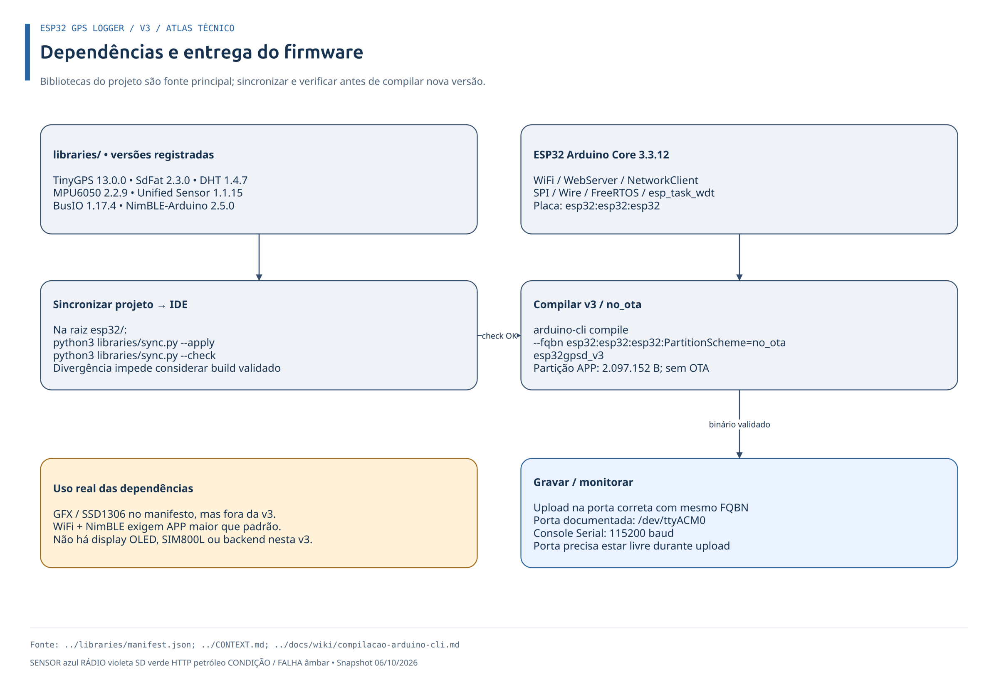

<div align="center">

# ESP32 GPS Logger v3

**Registra posição, movimento, clima e o entorno de rádio (WiFi e BLE) em cartão SD — e entrega os logs por um hotspot local quando o veículo para.**


</div>

> [!NOTE]
> **Escopo:** hardware e software de `esp32gpsd_v3.ino`, versão `serial-2026-10-06-painel2`. A v3 é a v2 acrescida do hotspot de download. Diagramas conferidos contra o firmware em 06/10/2026; não representam variantes históricas nem o projeto GSM. Status: **em teste** (ver [Validação](#validação-e-diagnóstico)).

## Índice

1. [Visão geral](#visão-geral)
2. [Início rápido](#início-rápido)
3. [Hardware](#hardware)
4. [Software e bibliotecas](#software-e-bibliotecas)
5. [Arquitetura e concorrência](#arquitetura-e-concorrência)
6. [Funcionamento](#funcionamento)
7. [Hotspot de download](#hotspot-de-download)
8. [Formato dos dados](#formato-dos-dados)
9. [Build e gravação](#build-e-gravação)
10. [Validação e diagnóstico](#validação-e-diagnóstico)
11. [Referência técnica](#referência-técnica)
12. [Estrutura do repositório](#estrutura-do-repositório)

---

## Visão geral

O logger coleta, em um ESP32, dados de **GPS**, **temperatura e umidade (DHT22)**, **aceleração e giroscópio (MPU6050)**, **redes WiFi** e **dispositivos BLE** próximos, e grava tudo em CSV no cartão SD (SdFat) para análise posterior em Python/pandas, Excel ou QGIS.

| Capacidade | Como funciona |
|---|---|
| Registro contínuo | GPS + DHT22 + MPU6050 em `log.txt`; WiFi em `wifi.txt`; BLE em `ble.txt` |
| Economia do SD | 3 buffers circulares em RAM; gravação em lote, só sem rádio ativo |
| Dois modos de vida | **Movimento** (scan a cada ≥30 s) e **Parado** (1 ciclo final → hotspot → sono) |
| Entrega dos logs | Ponto de acesso WiFi `ESP32GPS-Logs` em `http://192.168.4.1/` quando parado |
| Robustez | Watchdog de 60 s, remount automático do SD, buffers que descartam o mais antigo, sem travar |


O `loop()` trabalha em ciclos de ≈1 s: lê a UART do GPS, drena a fila BLE sem bloquear e amostra o MPU6050 a cada 100 ms; `vTaskDelay(1)` cede CPU dentro do ciclo.

---

## Início rápido

1. **Ligue** GPS, DHT22, MPU6050 e SD conforme a [tabela de pinos](#ligações).
2. **Sincronize as bibliotecas** (na raiz `esp32/`): `python3 libraries/sync.py --apply`.
3. **Compile:** `arduino-cli compile --fqbn esp32:esp32:esp32:PartitionScheme=no_ota esp32gpsd_v3`.
4. **Grave** na placa e abra o monitor serial a **115200 baud** (ver [Build](#build-e-gravação)).
5. **Pare o veículo** → após o ciclo final de scan, conecte-se ao WiFi `ESP32GPS-Logs` (senha `gpsdlogs2026`), abra `http://192.168.4.1/` e baixe os arquivos.

---

## Hardware

### Placa

| Item | Especificação |
|---|---|
| Placa de desenvolvimento | **ESP32 Dev Module** (FQBN `esp32:esp32:esp32`) |
| Microcontrolador | ESP32 (Espressif), Xtensa LX6 dual-core, até 240 MHz |
| SRAM | 520 KB (heap livre típico: ≈76 KB com hotspot e BLE desligado) |
| Flash | 4 MB (QIO, 80 MHz); partição **No OTA** com 2 MB de aplicação |
| Rádio | WiFi 802.11 b/g/n 2,4 GHz (STA para scan, AP para hotspot); Bluetooth LE |
| Lógica | 3,3 V |
| Serial / USB | 115200 baud; porta `/dev/ttyACM0` no ambiente de desenvolvimento |

> [!NOTE]
> O repositório registra "ESP32 Dev Module" e flash de 4 MB. Variante exata do chip (ex.: D0WD) e do módulo (ex.: WROOM-32) **não foi registrada**; confirme com `esptool chip_id` se precisar.

### Sensores e módulos

| Módulo | Função | Interface | Parâmetros usados pelo firmware |
|---|---|---|---|
| GPS (ex.: NEO-6M) | Posição, velocidade (RMC), data/hora UTC | UART2 | 9600 baud 8N1; buffer RX de 1024 B; sentenças RMC e GGA |
| DHT22 | Temperatura e umidade | 1 fio, protocolo DHT (não Dallas) | leitura no mínimo a cada 2 s |
| MPU6050 | Aceleração e giroscópio, 6 eixos | I²C | ±16 g, ±1000 °/s, filtro 44 Hz; amostra a cada 100 ms, média por janela de 1 s |
| Cartão microSD | Armazenamento dos logs | SPI | SdFat, 16 MHz, FAT16/FAT32/exFAT |

> Faixas e precisões de fábrica (datasheet) não são medidas pelo firmware; consulte o datasheet do módulo adquirido. O MPU6050 é opcional: se ausente, o logger segue com campos `ac_*`/`gy_*` vazios.

### Ligações

| Componente | Interface | Pinos ESP32 |
|---|---|---|
| GPS | UART2 | RX = GPIO17, TX = GPIO16 |
| DHT22 | Digital (DHT) | GPIO32 |
| MPU6050 | I²C | SDA = GPIO21, SCL = GPIO22 |
| Cartão SD | SPI | CS = GPIO5, SCK = GPIO18, MOSI = GPIO23, MISO = GPIO19 |

I²C 21/22 e SPI 18/19/23 são os padrões do ESP32 Dev Module; o sketch define explicitamente CS5, UART 17/16 e DHT 32.


> [!WARNING]
> **Alimentação:** lógica em 3,3 V e GND comum. A tensão de cada módulo (GPS/DHT/IMU/SD) depende do modelo; confira o datasheet antes de ligar. O repositório **não contém** esquema elétrico completo, BOM, regulador, pull-ups ou desacoplamento: o diagrama mostra as interligações confirmadas, não um circuito pronto para fabricação. Picos de corrente de WiFi/BLE coincidindo com escrita no SD já causaram brownout em campo — por isso o flush só ocorre sem rádio em scan.

---

## Software e bibliotecas

**Ambiente validado:** `arduino-esp32` (core `esp32:esp32`) **3.3.12**, Arduino CLI, FreeRTOS do core. Versões abaixo registradas em [`libraries/README.md`](../libraries/README.md) e [`manifest.json`](../libraries/manifest.json).

| Biblioteca | Versão | Função |
|---|---|---|
| TinyGPS | 13.0.0 | Parser de sentenças NMEA |
| SdFat (Bill Greiman) | 2.3.0 | Sistema de arquivos/SD (substitui `SD` do core) |
| DHT sensor library (Adafruit) | 1.4.7 | DHT22 |
| Adafruit MPU6050 | 2.2.9 | Aceleração e giroscópio |
| Adafruit Unified Sensor | 1.1.15 | Interface comum (dependência) |
| Adafruit BusIO | 1.17.4 | I²C/SPI (dependência) |
| NimBLE-Arduino | 2.5.0 | Scan BLE ativo |
| Adafruit GFX / SSD1306 | 1.12.6 / 2.5.17 | Declaradas pelo pacote MPU6050; **não compiladas** pelos sketches atuais |
| WiFi, WebServer, NetworkClient, SPI, Wire, FreeRTOS, `esp_task_wdt` | 3.3.12 (core) | Scan e AP, HTTP, barramentos, tarefas/mutex, watchdog |

> [!IMPORTANT]
> As cópias em `libraries/` são a **fonte principal**. Antes de cada versão, rode `python3 libraries/sync.py --apply` e `--check` (copia projeto → IDE com verificação SHA-256 e backup em `~/Arduino/.esp32-library-backups/`).



---

## Arquitetura e concorrência

`loopTask` e `Hotspot_HTTP` rodam no **core 1**; a tarefa HTTP tem prioridade 2 e stack de 8192 bytes. A afinidade interna das pilhas WiFi/NimBLE é do IDF, não do sketch.

| Quem | Responsabilidade |
|---|---|
| Callback BLE | Produz registros e flags; envia à fila sem espera |
| `loopTask` | Único dono de buffers, caches, posição e Serial; consome a fila, formata CSV, faz flush |
| `Hotspot_HTTP` | Atende HTTP, lê o SD, publica métricas |
| `sdMutex` | Serializa o SD entre `flushBuffers()` e a tarefa HTTP |

Página usa snapshots `volatile`; contadores/estado HTTP usam `std::atomic`. Não existe tarefa `BLE_Consumer`.


### Inicialização (`setup()`)

1. `Serial` 115200; RX de `Serial2` em 1024 B, GPS a 9600.
2. Aloca os três buffers circulares no heap (falha impede o boot).
3. Inicia DHT22 e MPU6050 (opcional).
4. Monta o SD com retry a cada 500 ms (indefinido), cria cabeçalho e informa os 3 arquivos.
5. Reconfigura o TWDT para 60 s (`esp_task_wdt_reconfigure()`).
6. Incrementa `bootCount` e grava marcador `# BOOT` com o motivo do reset.
7. `setupBLE()` (fila + NimBLE), entra em Movimento e cria servidor/tarefa HTTP (`setupHotspot()`). Não inicia scan BLE imediatamente.

MPU ausente ou falha da tarefa HTTP permitem continuar com recursos reduzidos.


### Laço principal (`loop()`)

- Alimenta o watchdog; recebe UART, `drenarFilaBLE()`, amostra o MPU por ≈1 s.
- Lê o DHT respeitando 2 s; com novos dados GPS chama `processarDadosGPS(mediaMPU)`.
- Ao fim de cada volta normal: `servicoModo()` (temporizadores e scans), transições de download, flush pendente e resumo Serial — mesmo sem fix GPS.
- Em **foco do hotspot** o `loop()` apenas pausa (ver [Hotspot](#hotspot-de-download)).


---

## Funcionamento

### Estados Movimento/Parado

Não há deep sleep nem reinício periódico; `PARADO_SONO` é uma espera lógica sem scan. `atualizarModo(kmh)` é chamado por `receberGPS()` a cada RMC com velocidade válida; `servicoModo()` trata temporizadores e fechamento de ciclo.

| Limiar | Valor |
|---|---|
| Considerado parado | velocidade ≤ **2 km/h** |
| Volta ao movimento | > **5 km/h** por **5** RMC válidos consecutivos |
| Cadência de log em movimento / parado | 10 s / 30 s |
| Ciclo de scan em movimento | ≥ 30 s após o fim do anterior, com RMC válido |
| Sono entre checks / janela do hotspot | 5 min / 5 min |


| Transição | Condição |
|---|---|
| MOVIMENTO → CHECK | ≤ 2 km/h. Aproveita ciclo aberto ou inicia ciclo WiFi+BLE final |
| CHECK → HOTSPOT | Ambos os ramos de scan encerrados (inclusive por falha); tenta flush, drena fila e desliga BLE antes do AP. Flush falho não impede o AP. Sem HTTP/AP → SONO |
| HOTSPOT → SONO | 5 min sem atividade e sem download; fecha o AP e tenta flush |
| SONO → CHECK | Após 5 min, um único ciclo; ao terminar, retoma o hotspot |
| Parado → MOVIMENTO | > 5 km/h por 5 RMC consecutivos. Leitura ≤ 5 zera o contador; 2–5 km/h não retorna; RMC inválido não decide |

### Aquisição GPS e sensores

Posição, data e hora são validados antes de entrar no CSV. UTC → UTC-3 via `struct tm`/`mktime()`, tratando virada de dia/mês/ano; campos inválidos ficam vazios. Somente **RMC** com velocidade válida renova a velocidade e dispara decisões; GGA não. Após 3 s sem velocidade válida, o modo permanece. WiFi/BLE usam a última posição conhecida.


### Ciclo de rádio coordenado

`iniciarCicloRadio()` inicia o BLE (scan ativo de 5 s); `servicoModo()` dispara e consulta o scan WiFi assíncrono (`scanNetworks(true, true)` inclui SSIDs ocultos; o segundo argumento não faz scan passivo). Falha de início/término é registrada e conclui o ramo, para não confundir falha com scan vazio.


### Buffers circulares e gravação no SD

Três buffers por linha no **heap** (`malloc`, em `setup()`) reduzem o desgaste do SD:

| Buffer | Capacidade | Arquivo |
|---|---|---|
| `logBuffer` | 150 × 160 B (≈24 KB) | `log.txt` |
| `wifiBuffer` | 50 × 256 B (≈12,8 KB) | `wifi.txt` |
| `bleBuffer` | 50 × 256 B (≈12,8 KB) | `ble.txt` |

Cheio, o buffer sobrescreve a linha mais antiga (nunca bloqueia). 150 linhas a cada 30 s ≈ **75 min** de buffer GPS parado.

`flushBuffers()` grava os 3 buffers em uma passada (1 open/close por arquivo, sem cópia intermediária) **somente** quando:

- nenhum rádio está em scan (`scanEmAndamento` e `bleScanAtivo` falsos);
- não há download (`downloadAtivo` falso, checado antes e depois de pegar o `sdMutex`);
- é a `loopTask` quem executa.

Um lote só sai do buffer após confirmar tamanho escrito, `sync()` e `close()`, **por arquivo**. Falha retém o lote inteiro (um retry pode duplicar linhas já escritas) e tenta remount; após **10** falhas seguidas o ESP32 reinicia.

> [!WARNING]
> Perda abrupta de energia descarta o que ainda está nos buffers.


### Deduplicação por hash

SSIDs e MACs BLE já vistos são guardados como **hash FNV-1a de 32 bits** (4 B/entrada), em caches de 500 entradas (`RTC_DATA_ATTR`), inseridos antes da gravação no SD.

- Não limpas por flush, troca de modo ou sono. Retenção em reset depende do tipo de reset (validar em placa); power-off apaga.
- Colisões podem descartar identificadores distintos; WiFi deduplica **SSID**, não BSSID.
- Cache cheio → aviso único; IDs conhecidos continuam deduplicados, novos são gravados mas não entram no cache.
- Linha perdida depois por sobrescrita/falha não será reobservada.


---

## Hotspot de download

Parado → 1 ciclo WiFi+BLE → flush → abre o AP. Sem atividade por 5 min → fecha o AP → sono de 5 min sem scan → novo check → reabre. Movimento detectado fecha o AP e aborta a transferência.

| Item | Valor (topo do `.ino`) |
|---|---|
| SSID / senha | `ESP32GPS-Logs` / `gpsdlogs2026` (`HOTSPOT_SSID`, `HOTSPOT_PASS`; WPA2, 8–63 caracteres) |
| Endereço | `http://192.168.4.1/`, canal 1, 1 estação por vez |
| Janela | `HOTSPOT_IDLE_MS` = 5 min; abrir/atualizar a página ou baixar renova (só conectar ao WiFi, não) |
| Arquivos | `log.txt`, `wifi.txt`, `ble.txt`, enviados byte a byte como estão no SD |


> [!WARNING]
> **Limitação atual:** durante o foco HTTP/download o firmware descarta a UART do GPS e **não detecta movimento**; a transição só ocorre após retomar o GPS. Também **não são adicionadas linhas GPS/sensores** nesse período.

**Heap.** Com WiFi AP + BLE o heap caía a ≈13 KB e a página/downloads falhavam. Antes do AP, `entrarModoParadoHotspot()` esvazia a fila, chama `bleParar()` (`NimBLEDevice::deinit`) e o heap sobe a ≈76 KB; `bleScanLigar()` reinicia o BLE no próximo ciclo.

**Foco.** Com acesso HTTP/download nos últimos 8 s (`HOTSPOT_FOCO_MS`), `loop()` pausa (sem GPS/MPU/SD/painel; só descarta a UART e alimenta o watchdog). Flush/remount ficam adiados e os dados permanecem em RAM. Esse retorno antecipado não executa `servicoModo()`.

### Página e painel

`/` é HTML5 + CSS embutido (`PAGINA_CSS`, flash), **sem scripts e sem recursos externos** (só um `confirm()` inline no botão Apagar), enviada em blocos (chunked). Mostra quatro cards — **WiFi** (redes no último scan), **BLE** (dispositivos do ciclo), **temperatura** e **umidade** — e a lista de arquivos, cada um com **Baixar** e **Apagar**. Valores são gravados a cada carga e mudam ao clicar em **Atualizar**. Segue o tema claro/escuro do aparelho.

### Download (`GET /download?file=...`)

Aceita somente `log.txt`, `wifi.txt` e `ble.txt`. Lê blocos de até 2048 B sob `sdMutex` e o libera durante o envio TCP; o arquivo fica aberto e `downloadAtivo` bloqueia escrita/remount até o fim.

| Código | Causa |
|---|---|
| 400 | Nome de arquivo inválido |
| 404 | Arquivo ausente |
| 503 | SD ocupado/indisponível, falha de abertura, arquivo > 4 GiB − 1 B (`Content-Length` de 32 bits) ou download em curso |

Abortos: 15 s sem progresso (`HTTP_STALL_MS`), desconexão, erro de leitura do SD ou AP fechado; a conexão incompleta deixa o navegador detectar a falha. Sucesso exige todos os bytes enviados e fechamento do arquivo. O log cresce ≈1,3 MB/dia.


### Apagar (`POST /apagar?file=...`)

Botão **Apagar** (com confirmação no navegador) remove o arquivo do SD sob `sdMutex`. Só POST; mesma lista de nomes do download. Nome inválido → 400; download em curso ou SD ocupado/indisponível → 503; sucesso → 303 para `/`. Ao apagar `log.txt`, o cabeçalho CSV é recriado na hora. O flush seguinte recria `wifi.txt`/`ble.txt` (`O_CREAT`, sem cabeçalho) e as linhas ainda nos buffers de RAM vão para o arquivo novo. Renova a janela do hotspot.

---

## Formato dos dados

Sem cabeçalho, exceto `log.txt`, que também contém marcadores `# BOOT` — ferramentas de análise devem ignorar linhas iniciadas por `#`.


### `log.txt` — GPS + DHT22 + MPU6050

```
data_hora, lat, lon, sat, hdop, kmh, direcao, umidade, temp_dht, ac_x, ac_y, ac_z, gy_x, gy_y, gy_z
12/07/2026 19:30:00, -23456789, -46789123, 8, 1.20, 45.30, NE, 72.5, 28.3, 1.23, -0.45, 9.81, 0.01, -0.02, 0.00
```

| Campo | Unidade |
|---|---|
| `lat`, `lon` | milionésimos de grau (÷ 1.000.000 = graus decimais) |
| `kmh` | km/h |
| `umidade`, `temp_dht` | % UR, °C |
| `ac_*` | m/s² |
| `gy_*` | rad/s |

Sem MPU6050, `ac_*`/`gy_*` ficam vazios.

### `wifi.txt`

```
DD/MM/AAAA HH:MM:SS, lat, lon, SSID, RSSI, canal, criptografia
12/07/2026 19:30:01, -23456791, -46789145, MinhaRede, -65, 6, WPA2
```

### `ble.txt`

```
DD/MM/AAAA HH:MM:SS, lat, lon, MAC, nome, RSSI, tx_power
12/07/2026 19:31:10, -23456791, -46789145, AA:BB:CC:DD:EE:FF, MeuFone, -70, 4
```

`nome` e `tx_power` ficam vazios se não anunciados. Data, `lat` e `lon` são a **última posição conhecida** no consumo por `drenarFilaBLE()`, não o instante exato da detecção.

### Fuso horário

O GPS entrega UTC; o código subtrai 3 h (UTC-3, Brasília) com `struct tm`/`mktime()`. Para outro fuso, altere `t.tm_hour = hora - 3;`.

---

## Build e gravação

**Arduino IDE:** Tools → Partition Scheme → **"No OTA (Large APP)"**. WiFi + NimBLE excedem a partição APP padrão (≈1,2 MB) em placa de 4 MB.

**Arduino CLI** (na raiz `esp32/`, após sincronizar bibliotecas):

```sh
arduino-cli compile --fqbn esp32:esp32:esp32:PartitionScheme=no_ota esp32gpsd_v3
```

No core 3.3.12 a partição aparece como "No OTA (2MB APP/2MB SPIFFS)"; a v3 ocupa ≈1,29 MB de 2 MB. A placa não se identifica por USB (`board list` → "Unknown"), então o FQBN é sempre passado à mão. Ambiente completo, gravação, monitor e problemas conhecidos: [`compilacao-arduino-cli.md`](../docs/wiki/compilacao-arduino-cli.md).

---

## Validação e diagnóstico

Build: ESP32 core 3.3.12, `esp32:esp32:esp32:PartitionScheme=no_ota`; bibliotecas sincronizadas e verificadas com `libraries/sync.py`.

| Status | Item |
|---|---|
| ✅ Na placa | Hotspot, páginas e download dos 3 arquivos (heap ≈76 KB com BLE desligado) |
| ✅ No host | `python3 esp32gpsd_v3/tests/test_serial.py` (requer `g++`): TinyGPS real + funções do sketch com SD simulado — checksum, GGA/idade da velocidade, RMC vazio, posição incompleta, CSV/UTC-3, escrita parcial, sync/close, cache cheio, sobrescrita |
| ⏳ Pendente | Sem GPS, troca de modo, hotspot/download e remoção do SD em campo |

Lote incerto deve permanecer retido e nunca aparecer como confirmado. Testes no host não substituem testes em placa.

**Console Serial.** Resumo de 3–4 linhas a cada 5 s (30 s com AP; mudo em download): uptime, modo, velocidade RMC, duração do loop, posição, DHT, aceleração Z, ciclo RF, ocupação dos buffers, estado do SD, heap livre/maior bloco, perdas e, com AP, SSID, clientes, prazo de fechamento e contadores web/download. Eventos trazem `[EVT]`/`[ERR]`/`[OK ]`, número e fase do loop. Detalhes e critérios em [`serial.md`](serial.md).


**Notas para evolução**

- Sem calibração de offset do MPU6050: coletar amostras em repouso e subtrair o bias.
- O scan WiFi consome tempo; em alta velocidade pode afetar registros GPS consecutivos.
- `BLEDeviceRecord` descarta manufacturer data, service UUIDs e appearance; reavaliar se o CSV precisar deles.
- Linhas dos buffers (160/256 B) comportam o formato atual; aumentar se houver novos campos.

---

## Referência técnica

<details>
<summary><strong>Defines e constantes</strong></summary>

```cpp
// GPS
#define GPS_RX          17
#define GPS_TX          16
#define GPS_Serial_Baud 9600

// DHT22
#define DHTPIN  32
#define DHTTYPE DHT22

// SD (SdFat)
const uint8_t SD_CS_PIN = 5;
#define SPI_CLOCK SD_SCK_MHZ(16)   // reduzir p/ 10 ou 4 MHz se houver falha de leitura/escrita

// Buffers circulares (linhas) e caches de deduplicação (hash FNV-1a 32 bits)
#define LOG_BUFFER_MAX    150
#define WIFI_BUFFER_MAX   50
#define BLE_BUFFER_MAX    50
#define SSID_CACHE_MAX    500
#define BLE_CACHE_MAX     500

#define WDT_TIMEOUT_S         60   // reset se o loop não alimentar o watchdog
#define SD_REMOUNT_MAX_FALHAS 10   // falhas seguidas antes de reiniciar o ESP32

// Movimento/Parado
#define PARKED_KMH_THRESHOLD   2.0
#define MOVING_KMH_THRESHOLD   5.0
#define MOVING_DEBOUNCE_FIXES  5
#define PARKED_SLEEP_MS        (5UL * 60UL * 1000UL)
#define RADIO_SCAN_INTERVAL_MS 30000UL
#define LOG_ADD_MOVING_MS      10000UL
#define LOG_ADD_PARKED_MS      30000UL

#define MODO_MOVIMENTO      0
#define MODO_PARADO_SONO    2
#define MODO_PARADO_CHECK   3
#define MODO_PARADO_HOTSPOT 4

// Hotspot
#define HOTSPOT_SSID    "ESP32GPS-Logs"
#define HOTSPOT_PASS    "gpsdlogs2026"
#define HOTSPOT_CANAL   1
#define HOTSPOT_IDLE_MS (5UL * 60UL * 1000UL)
#define HTTP_STALL_MS   15000UL
#define HTTP_BLOCO      2048
#define HOTSPOT_FOCO_MS 8000UL

// BLE
#define BLE_SCAN_DURATION_MS 5000
#define BLE_QUEUE_DEPTH      10
#define BLE_DEVICE_NAME_LEN  65

// Arquivos no SD
const char* logFileName  = "/log.txt";
const char* wifiFileName = "/wifi.txt";
const char* bleFileName  = "/ble.txt";
```

</details>

<details>
<summary><strong>Objetos e estado global</strong></summary>

| Objeto/variável | Tipo | Descrição |
|---|---|---|
| `gps` | `TinyGPS` | Parser NMEA da `Serial2` |
| `dht` | `DHT` | Temperatura e umidade |
| `mpu` | `Adafruit_MPU6050` | IMU |
| `sd` | `SdFs` | Volume SdFat (FAT16/FAT32/exFAT) |
| `mpuDisponivel` | `bool` | MPU6050 inicializado com sucesso |
| `bleQueue` | `QueueHandle_t` | Fila de 10 ponteiros; callback produz, `drenarFilaBLE()` consome sem bloquear |
| `modoAtual`, `modoInicio` | `uint8_t`, `unsigned long` | Estado da máquina e `millis()` da entrada (RAM comum, não sobrevive a restart) |
| `radioCicloAtivo`, `radioCicloWifiDone`, `radioCicloBleDone`, `radioCicloInicio`, `ultimoCicloFim` | `bool`/`unsigned long` | Controle do ciclo WiFi+BLE |
| `ssidCacheHash`, `bleCacheHash` | `RTC_DATA_ATTR uint32_t[]` | Caches FNV-1a dos IDs observados |
| `bootCount` | `RTC_DATA_ATTR uint32_t` | Contador de boot; gravado em `log.txt` a cada boot |

</details>

<details>
<summary><strong>Estruturas de dados</strong></summary>

```cpp
struct DadosMPU {
  float acX, acY, acZ;  // m/s²
  float gyX, gyY, gyZ;  // rad/s
};

struct WifiStats {
  int total;  // redes no scan
  int novas;  // gravadas
  int dup;    // ignoradas
};

// Alocado no heap, transportado pela fila até drenarFilaBLE()
struct BLEDeviceRecord {
  char     address[18];
  char     name[65];
  bool     hasName;
  int8_t   rssi;
  int8_t   txPower;
  bool     hasTxPower;
};
```

</details>

<details>
<summary><strong>Funções</strong></summary>

| Função | O que faz |
|---|---|
| `appendFile(path, msg) → bool` | Append no SD; `true` só com abertura, tamanho, `sync()` e `close()` confirmados |
| `remontarSD() → bool` | `sd.end()` + `sd.begin()`; reinicia o ESP32 após `SD_REMOUNT_MAX_FALHAS` falhas |
| `appendLinhasCirculares(...) → int` | Grava um buffer circular em ordem cronológica (1 open/close); `count` se confirmado, 0 em falha |
| `adicionarLinhaCircular(...)` | Insere linha; cheio, descarta a mais antiga |
| `flushBuffers() → bool` | Grava os 3 buffers (ver [Buffers](#buffers-circulares-e-gravação-no-sd)) |
| `inicializarArquivoLog()` | Cria o cabeçalho de `log.txt` se ausente |
| `hashString`, `hashJaVisto`, `adicionarHashCache` | FNV-1a 32 bits e cache genérico (SSID e MAC BLE) |
| `obterTipoCriptografia(wifi_auth_mode_t)` | Enum de segurança WiFi → `"open"`, `"WPA2"`, `"WPA3"`… |
| `modoNome(uint8_t)` | Nome legível do modo para Serial |
| `varrerWiFi(ts, lat, lon) → WifiStats` | Scan assíncrono + dedup + `wifiBuffer`; chamada por `servicoModo()` durante o ciclo |
| `exibirDashboard(...)` | Resumo Serial; só a `loopTask` escreve na Serial |
| `setupBLE()`, `bleIniciar()`, `bleParar()`, `bleScanLigar()`, `bleScanDesligar()`, `drenarFilaBLE()` | Ciclo de vida do BLE; `onResult()` descarta e conta `perdidos` se a fila estiver cheia; scan de 5 s; callback de término só publica flags |
| `atualizarModo(kmh)`, `entrarModoMovimento()`, `entrarModoParadoSono()`, `entrarModoParadoCheck()`, `entrarModoParadoHotspot()` | Máquina de estados |
| `iniciarCicloRadio()`, `atualizarCicloRadio()` | Ciclo WiFi+BLE (repetido em movimento, único no check) |
| `servicoModo()` | A cada volta normal: poll do scan WiFi, fechamento do ciclo, expiração de sono e de inatividade do hotspot |
| `processarDadosGPS(DadosMPU)` | Valida posição/hora, aplica UTC-3, decide por velocidade RMC, monta o CSV (10 s / 30 s) |
| `setup()`, `loop()` | Ver [Arquitetura](#arquitetura-e-concorrência) |

</details>

---

## Estrutura do repositório

```
esp32gpsd_v3/
├── esp32gpsd_v3.ino          Firmware v3
├── README.md                 Esta documentação
├── serial.md                 Console e critérios de validação
├── tests/test_serial.py      Regressões no host
└── docs/diagramas/
    ├── esp32gpsd-v3.drawio   Atlas editável (15 páginas)
    ├── 01-*.png … 15-*.png   Imagens com fonte DrawIO embutida
    ├── gerar_diagramas.py    Gerador do XML editável
    ├── paginas.tsv           Índice de exportação
    └── README.md             Fontes, legenda e reprodução
```

[Baixar o atlas DrawIO completo](docs/diagramas/esp32gpsd-v3.drawio) · [Fontes, legenda e exportação](docs/diagramas/README.md). Os 15 PNGs contêm o diagrama individual embutido: abrir no DrawIO permite editar blocos e conexões.
