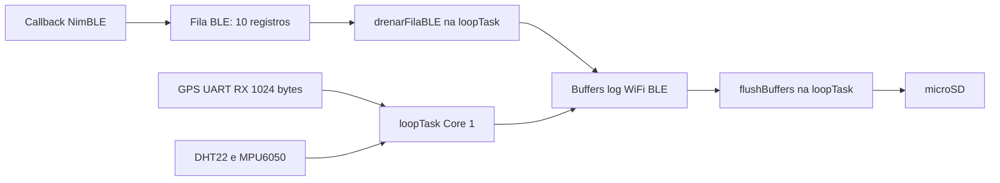

> **v3 (em teste):** `esp32gpsd_v3.ino` = v2 + hotspot de download dos logs quando parado (ver abaixo e [`hotspot.md`](hotspot.md)). Este documento descreve a v3 e identifica sua base v2.
>
> **v2:** v1 + (1) ciclo WiFi+BLE final ao parar; (2) flush no SD ao parar; (3) histerese de velocidade (limiar assimétrico + debounce); (4) consumo BLE na `loopTask`; (5) RX GPS de 1024 bytes e reconfiguração do watchdog.

## Hotspot de download (v3)

Parado → 1 ciclo WiFi+BLE → flush → abre o AP. Sem atividade por 5 min → fecha o AP → sono de 5 min sem scan → novo check → reabre. Ao voltar ao movimento (histerese atual), o AP fecha na hora, mesmo no meio de um download.

| Item | Valor (editar no topo do `.ino`) |
|---|---|
| SSID / senha | `ESP32GPS-Logs` / `gpsdlogs2026` (`HOTSPOT_SSID`, `HOTSPOT_PASS`; WPA2: 8 a 63 caracteres) |
| Endereço | `http://192.168.4.1/`, canal 1, 1 estação por vez |
| Janela | `HOTSPOT_IDLE_MS` = 5 min; abrir/atualizar a página ou baixar renova (conectar ao WiFi, não) |
| Arquivos | `log.txt`, `wifi.txt`, `ble.txt`, enviados byte a byte como estão no SD |

- Durante o download, o flush/remount do SD é adiado e os dados ficam nos buffers circulares (o buffer GPS parado aguenta cerca de 75 min).
- O download é abortado após 15 s sem progresso (`HTTP_STALL_MS`), por desconexão ou por movimento.
- A tarefa `Hotspot_HTTP` (core 1, prioridade 1, stack de 8 KB) atende o servidor; o `sdMutex` serializa o SD entre ela e a `loopTask`.
- Os temporizadores de sono/hotspot e o fechamento do ciclo de scan rodam a cada volta do `loop()`, mesmo sem fix GPS.
- Limite: arquivos acima de 4.294.967.295 bytes (4 GiB − 1 byte) são recusados (`Content-Length` de 32 bits); o log cresce cerca de 1,3 MB/dia.

# ESP32 GPS Logger — Documentação Completa

Rastreador baseado em ESP32 que coleta dados de **GPS**, **temperatura/umidade (DHT22)**, **aceleração/giroscópio (MPU6050)**, **redes WiFi** e **dispositivos BLE** próximos, gravando tudo em arquivos CSV no cartão SD (via SdFat) para análise posterior.

---

## Visão Geral



O `loop()` trabalha em ciclos de aproximadamente 1 s, lê UART GPS, drena a fila
BLE sem bloquear e amostra MPU6050 a cada 100 ms. Dentro desse ciclo,
`vTaskDelay(1)` cede CPU. Posição/hora e buffers pertencem à `loopTask`;
não há `BLE_Consumer`. O `sdMutex` existe só para serializar o SD entre a `loopTask` (`flushBuffers()`) e a tarefa `Hotspot_HTTP`.

`atualizarModo()` (transições por velocidade, a cada fix GPS) e `servicoModo()`
(temporizadores, poll do scan WiFi e fechamento do ciclo, a cada volta do
`loop()`) controlam modos e ciclos de rádio. A v3 mantém o ciclo final ao parar,
flush antes do hotspot/sono e retorno ao movimento com histerese, e implementa o
[hotspot](hotspot.md) como `MODO_PARADO_HOTSPOT`.

---

## Hardware

| Componente | Interface | Pinos ESP32 |
|-----------|-----------|-------------|
| Módulo GPS (ex: NEO-6M) | UART2 | RX=GPIO17, TX=GPIO16 |
| DHT22 | 1-Wire digital | GPIO32 |
| MPU6050 (IMU 6 eixos) | I2C | SDA=GPIO21, SCL=GPIO22 (padrão ESP32) |
| Cartão SD (via SPI, SdFat) | SPI | CS=GPIO5, clock configurável (`SPI_CLOCK`) |

> **Alimentação:** todos os sensores a 3.3 V. O módulo GPS pode exigir 5 V dependendo do modelo — verificar datasheet.

> **Build:** Arduino IDE → Tools → Partition Scheme → **"No OTA (Large APP)"**. Necessário porque WiFi + NimBLE juntos estouram a flash da partição padrão de 4 MB.
>
> **Arduino CLI:** `arduino-cli compile --fqbn esp32:esp32:esp32:PartitionScheme=no_ota --libraries libraries esp32gpsd_v3` (no core 3.3.12 a partição aparece como "No OTA (2MB APP/2MB SPIFFS)"; v3 ocupa ~1,26 MB de 2 MB). Ambiente, gravação, monitor e problemas conhecidos em [`docs/wiki/compilacao-arduino-cli.md`](../docs/wiki/compilacao-arduino-cli.md).

---

## Bibliotecas Utilizadas

Versões locais e sincronização obrigatória projeto → Arduino IDE estão em
[`libraries/README.md`](../libraries/README.md). Execute o sincronizador antes
de compilar cada nova versão.

| Biblioteca | Função | Instalação |
|-----------|--------|------------|
| `TinyGPS` | Parser de sentenças NMEA do GPS | Arduino Library Manager |
| `SdFat` (Bill Greiman) | Sistema de arquivos e acesso ao cartão SD (substitui `FS`/`SD` do core) | Arduino Library Manager → "SdFat" |
| `DHT` (Adafruit) | Leitura de temperatura e umidade do DHT22 | Arduino Library Manager → "DHT sensor library" |
| `WiFi` | Scan de redes WiFi (modo estação) | Embutida no ESP32 Arduino Core |
| `Adafruit_MPU6050` | Leitura de aceleração e giroscópio | Arduino Library Manager → "Adafruit MPU6050" |
| `Adafruit_Sensor` | Interface unificada Adafruit (dependência) | Instalada automaticamente com MPU6050 |
| `Wire` | Comunicação I2C com o MPU6050 | Embutida no Arduino Core |
| `esp_task_wdt` | Watchdog de tarefa (reset automático em travamento) | Embutida no ESP-IDF/core |
| `NimBLEDevice` (NimBLE-Arduino) | Scan ativo de dispositivos BLE | Arduino Library Manager → "NimBLE-Arduino" |

---

## Configuração (Defines e Constantes)

```cpp
// GPS
#define GPS_RX          17      // Pino RX da UART2 (recebe TX do GPS)
#define GPS_TX          16      // Pino TX da UART2 (envia RX do GPS)
#define GPS_Serial_Baud 9600    // Baud rate padrão dos módulos GPS NMEA

// DHT22
#define DHTPIN  32
#define DHTTYPE DHT22

// SD (SdFat)
const uint8_t SD_CS_PIN = 5;
#define SPI_CLOCK SD_SCK_MHZ(16)   // reduzir p/ SD_SCK_MHZ(10)/(4) se houver falha de leitura/escrita

// Buffers circulares (por linha): se o SD ficar indisponível e o buffer
// encher, as linhas mais antigas são descartadas para abrir espaço às novas
#define LOG_BUFFER_MAX    150    // linhas de log GPS
#define WIFI_BUFFER_MAX   100    // linhas de log WiFi
#define BLE_BUFFER_MAX    100    // linhas de log BLE

// Caches de deduplicação (guardam hash FNV-1a de 32 bits, não a string/MAC)
#define SSID_CACHE_MAX    500
#define BLE_CACHE_MAX     500

// Watchdog: se loop() não "alimentar" o watchdog nesse tempo, o ESP32 reseta
#define WDT_TIMEOUT_S 60

// Falhas seguidas de remount do SD antes de reiniciar o ESP32 inteiro
#define SD_REMOUNT_MAX_FALHAS 10

// Estado Movimento/Parado
#define PARKED_KMH_THRESHOLD 2.0   // <= isso: considerado parado
#define MOVING_KMH_THRESHOLD 5.0   // > isso por MOVING_DEBOUNCE_FIXES fixes seguidos: volta a Movimento
#define MOVING_DEBOUNCE_FIXES 5    // fixes (~1 s cada) consecutivos acima do limiar
#define PARKED_SLEEP_MS       (5UL * 60UL * 1000UL)  // sono entre checks (parado)
#define RADIO_SCAN_INTERVAL_MS 30000UL  // cadência do ciclo WiFi+BLE em movimento

#define LOG_ADD_MOVING_MS  10000UL   // cadência de gravação no buffer de log em movimento
#define LOG_ADD_PARKED_MS  30000UL   // cadência de gravação no buffer de log parado

#define MODO_MOVIMENTO      0
#define MODO_PARADO_SONO    2
#define MODO_PARADO_CHECK   3
#define MODO_PARADO_HOTSPOT 4

// Arquivos de log no SD
const char* logFileName  = "/log.txt";   // GPS + DHT22 + MPU6050
const char* wifiFileName = "/wifi.txt";  // Redes WiFi
const char* bleFileName  = "/ble.txt";   // Dispositivos BLE
```

---

## Objetos e Estado Globais

| Objeto/Variável | Tipo | Descrição |
|--------|------|-----------|
| `gps` | `TinyGPS` | Parser dos dados NMEA recebidos via Serial2 |
| `dht` | `DHT` | Sensor de temperatura e umidade |
| `mpu` | `Adafruit_MPU6050` | Sensor IMU de aceleração e giroscópio |
| `sd` | `SdFs` | Volume SdFat (auto-detecta FAT16/FAT32/exFAT), substitui o `SD` do core |
| `mpuDisponivel` | `bool` | `true` se o MPU6050 foi inicializado com sucesso |
| `bleQueue` | `QueueHandle_t` | Fila de 10 ponteiros; callback NimBLE produz registros e `drenarFilaBLE()` os consome sem bloquear na `loopTask`. |
| `modoAtual` | `uint8_t` | Estado atual da máquina Movimento/Parado (`MODO_MOVIMENTO`/`MODO_PARADO_SONO`/`MODO_PARADO_CHECK`/`MODO_PARADO_HOTSPOT`) — vive em RAM comum, não sobrevive a restart (não há mais restart periódico) |
| `modoInicio` | `unsigned long` | millis() de quando entrou no modo/substado atual |
| `radioCicloAtivo` / `radioCicloWifiDone` / `radioCicloBleDone` / `radioCicloInicio` / `ultimoCicloFim` | `bool`/`bool`/`bool`/`unsigned long`/`unsigned long` | Controlam o ciclo de scan WiFi+BLE simultâneo (Movimento: repetido a cada `RADIO_SCAN_INTERVAL_MS`; Parado/Check: disparado uma vez ao acordar) |
| `ssidCacheHash` / `bleCacheHash` | `RTC_DATA_ATTR uint32_t[]` | Caches de hash FNV-1a das SSIDs/MACs já gravadas — nunca resetam enquanto a placa fica ligada; ficam em RTC só pra sobreviver a um reset inesperado (watchdog, brownout), não a restarts planejados |
| `bootCount` | `RTC_DATA_ATTR uint32_t` | Contador de boot, incrementado em `setup()`. Sobrevive a soft-reset/watchdog; usado pra diagnosticar reset espúrio no meio de um ciclo (gravado em `log.txt` a cada boot) |

---

## Estado Movimento/Parado

WiFi e BLE **nunca desligam** — a placa não economiza mais energia, só cartão SD (menos gravações durante o sono parado). Os dois rádios sempre escaneiam **juntos**, em ciclos disparados por `iniciarCicloRadio()`/`atualizarCicloRadio()`; o que muda entre modos é só a cadência entre ciclos. `atualizarModo(kmh)` roda a cada fix de GPS (~1×/s), chamado de dentro de `processarDadosGPS()`; `servicoModo()` roda a cada volta do `loop()`, com ou sem fix:

```
MODO_MOVIMENTO (1 ciclo WiFi+BLE a cada RADIO_SCAN_INTERVAL_MS/30s)
   │  kmh <= 2 (PARKED_KMH_THRESHOLD)
   ▼
MODO_PARADO_CHECK (ciclo WiFi+BLE final: aproveita o aberto ou inicia um)
   │  ciclo fecha → entrarModoParadoHotspot(): flushBuffers() + abre o AP
   ▼
MODO_PARADO_HOTSPOT (sem scan; HOTSPOT_IDLE_MS/5 min sem atividade)
   │  inatividade → fecharHotspot() + entrarModoParadoSono()
   ▼
MODO_PARADO_SONO (sem nenhum scan, por PARKED_SLEEP_MS/5 min)
   │  passados 5 min
   ▼
MODO_PARADO_CHECK (1 ciclo WiFi+BLE, depois hotspot de novo)
   │
   └──► (repete CHECK → HOTSPOT → SONO enquanto ficar parado)

Parado → Movimento (qualquer sub-estado parado): kmh > 5 (MOVING_KMH_THRESHOLD)
por 5 fixes seguidos (MOVING_DEBOUNCE_FIXES). Histerese: ignora os picos de 2–5 km/h
que o GPS reporta parado; Movimento → Parado usa só kmh <= 2.
```

- **`MODO_MOVIMENTO`**: (entra com histerese, ver diagrama) dispara um ciclo de scan WiFi+BLE simultâneo a cada `RADIO_SCAN_INTERVAL_MS` (30s).
- **Ao parar** (`atualizarModo()`, Movimento→Parado): entra em `MODO_PARADO_CHECK` e roda 1 ciclo WiFi+BLE completo antes de abrir o hotspot (aproveita o ciclo aberto, ou chama `iniciarCicloRadio()`). Ao fechar, `atualizarCicloRadio()` chama `entrarModoParadoHotspot()` (sem hotspot disponível, cai direto no sono).
- **`MODO_PARADO_SONO`**: nenhum scan roda (nem WiFi nem BLE) por `PARKED_SLEEP_MS` (5 min). Ao entrar (`entrarModoParadoSono()`), `flushBuffers()` grava os 3 buffers no SD. O ciclo de rádio já está fechado nesse ponto (o sono só vem depois do hotspot, que vem do fim do check), então a v3 não precisa mais do fechamento forçado de ciclo.
- **`MODO_PARADO_CHECK`**: acorda do sono, dispara **um único ciclo** de WiFi+BLE simultâneo (dedup normal contra as caches persistentes), depois abre o hotspot (com flush) — só o veículo voltando a se mover interrompe o ciclo sono/check.
- GPS/DHT/MPU e o dashboard rodam a **1 Hz em qualquer sub-estado** — só a cadência de scan muda.
- BLE é inicializado **uma única vez** em `setup()` (`setupBLE()`, cria a fila e configura callbacks). Cada scan dura `BLE_SCAN_DURATION_MS` (5 s) e termina sem reinício em callback. `drenarFilaBLE()` consome a fila no `loop()`, sem tarefa extra.

---

## Sistema de Buffers em RAM (Circulares)

Para reduzir o desgaste do cartão SD, os dados são acumulados em 3 buffers circulares (por linha, não por byte) alocados no **heap** (`malloc`, em `setup()`) antes de serem gravados em disco.

| Buffer | Linhas × tamanho | Arquivo destino |
|--------|-------------------|------------------|
| `logBuffer` | 150 × 160 bytes (~24 KB) | `log.txt` |
| `wifiBuffer` | 100 × 256 bytes (~25,6 KB) | `wifi.txt` |
| `bleBuffer` | 100 × 256 bytes (~25,6 KB) | `ble.txt` |

Cada buffer é **circular**: se encher (SD indisponível por tempo suficiente), a linha mais antiga é sobrescrita para abrir espaço à mais recente — nunca trava a gravação em RAM esperando o SD.

A cadência com que `logBuffer` recebe novas linhas depende do modo: a cada `LOG_ADD_MOVING_MS` (10s) em movimento, a cada `LOG_ADD_PARKED_MS` (30s) em qualquer sub-estado parado — a leitura de GPS/DHT/MPU e o dashboard continuam a 1 Hz, só o *append* no buffer é throttled.

`flushBuffers()` grava os 3 buffers no SD numa única passada (1 open/close por arquivo, via `appendLinhasCirculares()`, sem montar cópia intermediária em RAM), só quando:
- nenhum rádio está em scan (`scanEmAndamento == false` e `bleScanAtivo == false` — evita coincidir pico de corrente do rádio com o pico da escrita física, causa já confirmada de brownout em campo);
- não há download em andamento (`downloadAtivo == false`, checado antes e depois de adquirir o `sdMutex`);
- é executado pela `loopTask`, proprietária dos buffers; o `sdMutex` protege o volume contra a leitura da tarefa `Hotspot_HTTP`.

Em caso de falha parcial de escrita, os dados não gravados permanecem no buffer circular, o SD é remontado (`remontarSD()`) e a tentativa é repetida no próximo ciclo — nada é descartado só por causa de uma falha transitória de escrita.

> **Nota:** em caso de perda abrupta de energia, os dados ainda no buffer (não gravados) serão perdidos.

---

## Deduplicação por Hash (SSID / BLE MAC)

Generalização das 2 caches de deduplicação: `hashString()` calcula FNV-1a de 32 bits de qualquer string; `hashJaVisto()`/`adicionarHashCache()` recebem array/contador/limite como parâmetros, reaproveitando a mesma lógica para SSID e MAC BLE (guardam 4 bytes/entrada em vez da string/MAC completa).

**Comportamento:**
- Cada cache vive em `RTC_DATA_ATTR` e **nunca reseta** enquanto a placa fica ligada (nem no flush, nem na troca de modo, nem no sono/check) — não há limpeza explícita durante flush ou mudanças de modo. O atributo RTC não equivale a armazenamento permanente em flash.
- Comparação por hash (equivalente a nome/MAC exato).
- Cache cheio (`SSID_CACHE_MAX`=500 / `BLE_CACHE_MAX`=500) → aviso único no Serial, novas entradas passam sem dedup a partir daí.
- O filtro nativo de duplicatas do NimBLE atua no scan (`setScanCallbacks(..., false)`). `seenInCycleBLE`, `bleParar` e reinício em `onScanEnd()` foram removidos. A dedup por hash permanece em `drenarFilaBLE()`.

---

## Estrutura de Dados

```cpp
struct DadosMPU {
  float acX, acY, acZ;  // Aceleração nos eixos X, Y, Z em m/s²
  float gyX, gyY, gyZ;  // Velocidade angular nos eixos X, Y, Z em rad/s
};

struct WifiStats {
  int total;   // Redes encontradas no scan
  int novas;   // Redes novas (gravadas)
  int dup;     // Redes duplicatas (ignoradas)
};

// Alocado no heap (malloc), transportado por FreeRTOS Queue até drenarFilaBLE()
struct BLEDeviceRecord {
  char     address[18];
  char     name[65];
  bool     hasName;
  int8_t   rssi;
  int8_t   txPower;
  bool     hasTxPower;
};
```

---

## Funções

### `appendFile(const char *path, const char *message) → bool`
Abre um arquivo no SD em modo **append** e grava a string `message` ao final. Retorna `true` só se abertura e escrita tiverem sucesso.

### `remontarSD() → bool`
Tenta remontar o cartão (`sd.end()` + `sd.begin()`), usado quando uma escrita falha. Após `SD_REMOUNT_MAX_FALHAS` falhas seguidas, reinicia o ESP32 inteiro.

### `appendLinhasCirculares(...) → int`
Grava as linhas de um buffer circular direto no arquivo (1 open/close), em ordem cronológica, sem montar cópia do buffer inteiro em RAM. Retorna quantas linhas foram efetivamente gravadas.

### `adicionarLinhaCircular(...)`
Adiciona uma linha a um buffer circular; se cheio, descarta a mais antiga.

### `flushBuffers() → bool`
Grava os 3 buffers no SD. Ver [Sistema de Buffers em RAM](#sistema-de-buffers-em-ram-circulares).

### `inicializarArquivoLog()`
Se `log.txt` ainda não existir, grava a linha de cabeçalho CSV. `wifi.txt`/`ble.txt` não têm cabeçalho (formato documentado abaixo).

### `hashString`, `hashJaVisto`, `adicionarHashCache`
Ver [Deduplicação por Hash](#deduplicação-por-hash-ssid--ble-mac).

### `obterTipoCriptografia(wifi_auth_mode_t) → const char*`
Converte o enum de segurança WiFi para string legível (`"open"`, `"WPA2"`, `"WPA3"`, etc.).

### `modoNome(uint8_t) → const char*`
Nome legível do modo atual (`"MOVIMENTO"`/`"PARADO (sono)"`/`"PARADO (check)"`), usado no Serial/dashboard.

### `varrerWiFi(timeStamp, lat, lon) → WifiStats`
Scan assíncrono (não-bloqueante) de redes WiFi. Filtra duplicadas pela cache de hash, acumula no `wifiBuffer`. Só é chamado por `servicoModo()` enquanto há um ciclo de scan ativo e o WiFi ainda não terminou a parte dele (`radioCicloAtivo && !radioCicloWifiDone`), usando a última posição/hora conhecida — a função em si não sabe nada sobre modos, é scan+dedup+buffer puro.

### `exibirDashboard(...)`
Painel ASCII no Serial Monitor: coordenadas, velocidade, direção, DHT22, MPU6050, modo Movimento/Parado atual (com contagem regressiva do sub-estado), estatísticas de WiFi, cadência de log atual, barra de progresso do buffer e contagem dos 3 buffers + 2 caches.

### BLE — `setupBLE()`, `bleScanLigar()`, `bleScanDesligar()`, `drenarFilaBLE()`
`setupBLE()` inicializa NimBLE e cria a fila uma vez. `onResult()` aloca o registro
e tenta enviá-lo sem espera; fila cheia ou falha de alocação descarta o achado.
O scan dura 5 s, sem callback de reinício. `drenarFilaBLE()` usa
`xQueueReceive(..., 0)` no `loop()`, deduplica MAC, formata CSV com a última
posição/hora GPS, acumula `bleBuffer` e libera cada registro. Nenhuma tarefa
consumidora separada é criada.

### Estado Movimento/Parado — `atualizarModo(kmh)`, `entrarModoMovimento()`, `entrarModoParadoSono()`, `entrarModoParadoCheck()`, `iniciarCicloRadio()`, `atualizarCicloRadio()`
Ver [Estado Movimento/Parado](#estado-movimentoparado). `atualizarModo()` é chamado a cada fix de GPS e decide, com base em `kmh` e no timer (`modoInicio`), se deve trocar de sub-estado — as funções `entrarModo*()` fazem a transição (resetam o timer do novo estado). `iniciarCicloRadio()`/`atualizarCicloRadio()` controlam o ciclo de scan WiFi+BLE simultâneo, reusado tanto em Movimento (repetido) quanto no check parado (único).

### `processarDadosGPS(DadosMPU mediaMPU)`
Função principal de processamento, executada quando o GPS produz um fix válido, **em qualquer modo**.

**Passos internos:**
1. Lê posição, data/hora, satélites, HDOP, velocidade e direção do objeto `gps`
2. Lê temperatura e umidade do DHT22
3. Converte data/hora UTC para UTC-3 (Brasília) via `mktime()`
4. Atualiza `lastTimeStamp`/`lastLat`/`lastLon` — usados por `drenarFilaBLE()` na própria `loopTask` para rotular achados BLE
5. Chama `atualizarModo(kmh)`
6. Monta a linha CSV (15 colunas) e acumula no `logBuffer`, respeitando a cadência (`LOG_ADD_MOVING_MS`/`LOG_ADD_PARKED_MS`)
7. Exibe `exibirDashboard()` com o último `WifiStats` (o poll do scan WiFi fica em `servicoModo()`)
8. Decide flush de `log.txt` por contagem (`LOG_BUFFER_MAX`)

### `servicoModo()`
Chamado a cada volta do `loop()`, com ou sem fix: poll de `varrerWiFi()` durante o ciclo, `atualizarCicloRadio()`, expiração do sono (→ `entrarModoParadoCheck()`) e inatividade do hotspot (→ `fecharHotspot()` + `entrarModoParadoSono()`).

### `setup()`
1. Inicia `Serial` a 115200; configura RX de `Serial2` em 1024 bytes antes de iniciar GPS a 9600.
2. Aloca os três buffers circulares no heap; falha impede inicialização.
3. Inicia DHT22 e MPU6050 opcional.
4. Monta SD com retry, cria cabeçalho e informa existência dos três arquivos.
5. No core Arduino 3.x, reconfigura TWDT com `esp_task_wdt_reconfigure()` para `WDT_TIMEOUT_S` (60 s); registra a tarefa atual.
6. Incrementa `bootCount` e grava marcador `# BOOT` com motivo do reset.
7. Inicializa NimBLE/fila, servidor WebServer e tarefa `Hotspot_HTTP`; entra em movimento, sem iniciar scan BLE imediatamente.

### `loop()`
- Alimenta watchdog; recebe UART, chama `drenarFilaBLE()` e amostra MPU durante aproximadamente 1 s.
- `vTaskDelay(1)` cede CPU dentro do ciclo de aquisição.
- Com novos dados GPS, chama `processarDadosGPS(mediaMPU)`; sem novos dados, mantém dashboard parcial.
- Ao fim de cada volta, `servicoModo()` trata temporizadores (sono/hotspot), poll do scan WiFi e fechamento do ciclo, independentes de haver fix GPS novo.

---

## Formato dos Arquivos de Saída

Todos sem cabeçalho, exceto `log.txt`.

### `log.txt`
```
data_hora, lat, lon, sat, hdop, kmh, direcao, umidade, temp_dht, ac_x, ac_y, ac_z, gy_x, gy_y, gy_z
12/07/2026 19:30:00, -234567890, -467890123, 8, 1.20, 45.30, NE, 72.5, 28.3, 1.23, -0.45, 9.81, 0.01, -0.02, 0.00
```
> `lat`/`lon` em milionésimos de grau (`÷ 1.000.000` = graus decimais). Sem MPU6050: campos `ac_*`/`gy_*` ficam vazios.

### `wifi.txt`
```
DD/MM/AAAA HH:MM:SS, lat, lon, SSID, RSSI, canal, criptografia
12/07/2026 19:30:01, -234567912, -467890145, MinhaRede, -65, 6, WPA2
```

### `ble.txt`
```
DD/MM/AAAA HH:MM:SS, lat, lon, MAC, nome, RSSI, tx_power
12/07/2026 19:31:10, -234567912, -467890145, AA:BB:CC:DD:EE:FF, MeuFone, -70, 4
```
> `nome` vazio se o dispositivo não anunciar. `tx_power` vazio se não anunciado (campo `hasTxPower == false`). `lat`/`lon`/`data_hora` de `ble.txt` são a **última posição conhecida do GPS** (`lastTimeStamp`/`lastLat`/`lastLon`) no consumo por `drenarFilaBLE()`, dentro da `loopTask`; não representam a posição exata no instante da detecção.

---

## Fuso Horário

O GPS fornece hora em **UTC**. O código subtrai 3 horas para **UTC-3 (Brasília)** usando `struct tm` e `mktime()`, que trata automaticamente a virada de meia-noite, mudança de dia, mês e ano.

Para outros fusos, alterar a linha:
```cpp
t.tm_hour -= 3;  // UTC-3 → alterar para o offset desejado
```

---

## Dependências de Instalação (Arduino IDE)

Antes de cada nova versão, execute a sincronização projeto → IDE e confira
as versões conforme [`libraries/README.md`](../libraries/README.md). O Library
Manager serve para obter os pacotes; as cópias locais são a fonte principal.

1. **TinyGPS** — Library Manager → buscar `TinyGPS`
2. **SdFat** (Bill Greiman) — Library Manager → buscar `SdFat`
3. **DHT sensor library** (Adafruit) — Library Manager → buscar `DHT sensor library`
4. **Adafruit MPU6050** — Library Manager → buscar `Adafruit MPU6050` *(instala `Adafruit Unified Sensor` automaticamente)*
5. **NimBLE-Arduino** — Library Manager → buscar `NimBLE-Arduino`
6. **ESP32 Arduino Core** — Boards Manager → `esp32` by Espressif *(inclui `WiFi`, `Wire`, `esp_task_wdt`)*
7. **Partition Scheme:** Tools → Partition Scheme → **"No OTA (Large APP)"**

---

### Painel da página de download

`http://192.168.4.1/` mostra, acima da lista de arquivos, quatro cards: **WiFi** (redes no último scan), **BLE** (dispositivos do ciclo), **temperatura** e **umidade** (DHT22). É HTML5 + CSS embutido (`PAGINA_CSS`, na flash), sem JavaScript e sem recursos externos; os valores são gravados no HTML a cada carga e só mudam ao clicar em **Atualizar**. Segue o tema claro/escuro do aparelho. Detalhes de build em [`compilacao-arduino-cli.md`](../docs/wiki/compilacao-arduino-cli.md).

---

## Estrutura de Arquivos do Projeto

```
esp32gpsd_v3/
├── esp32gpsd_v3.ino   ← Logger com hotspot e download HTTP
├── README.md          ← Esta documentação
└── hotspot.md         ← Plano original e diferenças da implementação

archive/ble_scanner_poc/
└── ble_scanner_poc.ino  ← PoC original do antigo RF Phase Sequencer (BLE ↔ BT ↔ WiFi
                            via restart) — arquitetura já substituída no esp32gpsd.ino
                            pelo estado Movimento/Parado em RAM, sem restart

archive/esp32gpsd_dualcore/
└── esp32gpsd_dualcore.ino  ← Versão dual-core (só GPS/DHT/MPU/SD/WiFi
                                divididos em 2 tasks por núcleo) — ver README raiz e archive/esp32gpsd_dualcore/DUALCORE.MD
```

---

## Notas para Desenvolvimento Futuro

- **Análise dos dados:** os CSVs são compatíveis com Python (pandas), Excel e QGIS (plotar trajetos com lat/lon)
- **Calibração do MPU6050:** sem calibração de offset no código atual; considerar coletar amostras em repouso e subtrair o bias
- **WiFi scan:** consome tempo por execução; em velocidades altas pode impactar registros consecutivos do GPS
- **Tamanho das linhas dos buffers:** `logBuffer[160]`, `wifiBuffer`/`bleBuffer[256]` — suficiente para o formato atual; aumentar se campos extras forem adicionados
- **BLE:** `BLEDeviceRecord` descarta de propósito manufacturer data, service UUIDs e appearance (sem consumidor hoje) — reavaliar se o CSV precisar desses campos

---
